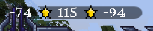
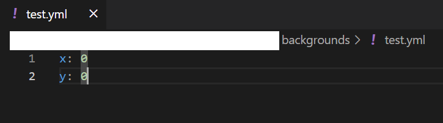

# 背景

:::warning 过时

在 BetterHud 1.9 中，背景将被重构。

:::

可以为你的文本创建一个背景图片。



背景文件夹的结构如下所示

```
backgrounds
└── example1.yml
    └── example1
        └── left.png
        └── body.png
        └── right.png
└── example2.yml
    └── example2
        └── left.png
        └── body.png
        └── right.png
...
```

1. yml 文件和文件夹名称必须相同。
2. 将 left.png、body.png、right.png 放入一个文件夹中。
3. 其余设置在 [布局文档](layouts) 中。

这些是 left.png、body.png 和 right.png 的示例文件。
  

***
yml 文件的组织很简单。

example1.yml
```
x: 0
y: 0
```
