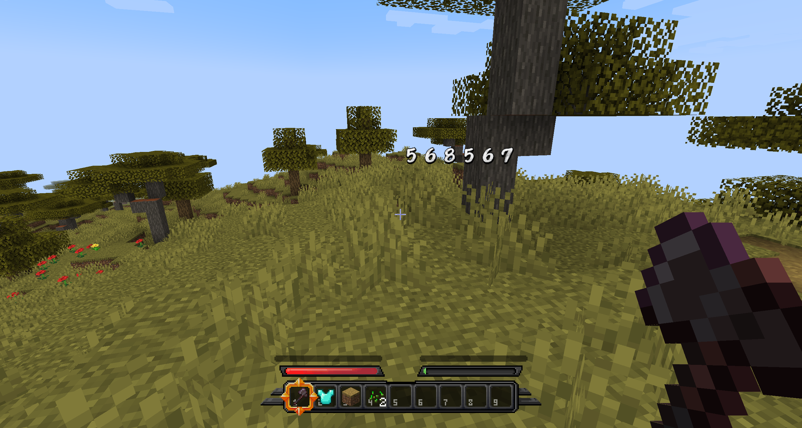

# 字体

使用多种自定义字体的能力。

请参阅布局文档以了解如何使用它。

## 如何添加字体
1. 将扩展名为ttf和otf的文件放入fonts文件夹中。


2. 在texts文件夹中创建一个yml文件，文件名自定。


3. 输入以下内容
``` yaml
example_font:
  file: example.ttf
  scale: 16
```

### 使用Minecraft字体
注意：这模仿了Minecraft的默认字体，并不使用默认字体，因此无法使用插件（如itemsadder）添加的图像字体，例如字形。
``` yaml
default_font:
  scale: 16
  merge-default-bitmap: true
```
如果使用默认字体，则无法使用字形。


### 如何添加字形
``` yaml
example_font:
  file: example.ttf
  scale: 16
  images:
    star:
      name: "star.png"
      x: 0
      y: 0
      scale: 2.0
```
可以添加具有此样式的图像，然后在文本布局模式中以`<image:star>`的方式使用它。

## 如何更改第一个Bossbar字体
1. font.yml `merge-default-bitmap: false`

2. 将字体文件放置在betterhud插件文件夹中，并在config.yml中修改字体名称。
   

### 使用Minecraft Unifont
``` yaml
font:
  file: some_name
  use-unifont: true
```
通过此配置，您可以使用Minecraft默认的Unifont。

### 排除其他语言
``` yaml
scale: 16
height: 8
ascent: 7
merge-default-bitmap: true
use-unifont: true
include:
- korean
```
如果您想减少资源包的大小，可以使用“include”配置指定某些语言。
拉丁字母始终包含在内，其他语言如下：

- korean - 韩国
- japan - 日本
- china - 中国
- russia - 俄罗斯
- bengal - 孟加拉
- thailand - 泰国
- greece - 希腊
- hindi - 印地语
- arab - 阿拉伯
- hebrew - 希伯来语

### 位图字体

用于轻松将图像导入为字体。


```
number_font:
  type: bitmap
  chars:
    1:
      file: "font/test.png"
      codepoints:
       - "abcdefgh"
       - "12345678"
```
codepoint是用于输出图像的参数，

简单来说，您输入的字符将在该位置作为图像输出。

使用多行时，所有行必须具有相同数量的字符




### bitmap font

Use to easily import images as fonts.


```
number_font:
  type: bitmap
  chars:
    1:
      file: "font/test.png"
      codepoints:
       - "abcdefgh"
       - "12345678"
```
codepoint is a parameter used to output an image,

which simply means that the character you type will be output as an image at that location.

When using multiple lines, all lines must have the same number of characters

