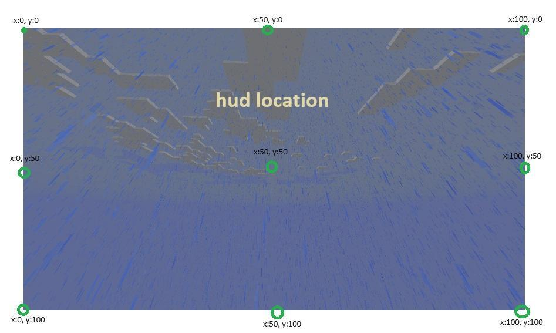

# Hud

HUD可以被视为一种打包和管理布局的方式。

**GUI坐标可以以小数增量进行调整。**

```yaml
example_hud:
  layouts:
    1:
      name: layout_name_1
      x: 35
      y: 90
    2:
      name: layout_name_2
      x: 65
      y: 90
    3:
      name: layout_name_3
      x: 40.8
      y: 90.4
    ...
```

与布局略有不同的是，HUD中的坐标是以玩家屏幕的百分比给出的。

这就是为什么HUD的位置有时会根据GUI比例而变化。

## HUD的位置随GUI比例变化


这个问题是由于HUD在改变GUI比例时没有按比例缩放引起的。

因此，如果你希望它们与GUI比例直接成比例放置，

你应该使用HUD的坐标为0,50,100，仅参考末端和中心位置。

建议你随后在布局中调整坐标。


这是使用内置HUD修改后的文件。

default-hud.yml

```
test_hud:
  layouts:
    1:
      name: health
      x: 50
      y: 100
    2:
      name: hunger
      x: 50
      y: 100
```

default-layout.yml
```
health:
  images:
    1:
      name: health_empty
      x: -62
      y: -24
    2:
      name: health_bar
      x: -47
      y: -20
    3:
      name: armor_empty
      x: -62
      y: -9
    4:
      name: armor_bar
      x: -47
      y: -5
  animations:
    duration: 60
    x-equation: 0
    y-equation: 3cos(t/30 * pi)

hunger:
  images:
    1:
      name: hunger_empty
      x: 63
      y: -24
    2:
      name: hunger_bar
      x: 65
      y: -20
    3:
      name: air_empty
      x: 63
      y: -9
    4:
      name: air_bar
      x: 65
      y: -5
  animations:
    duration: 60
    x-equation: 0
    y-equation: 3cos(t/30 * pi)
```

