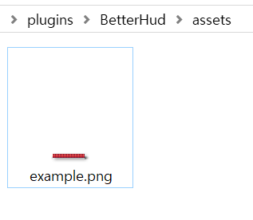
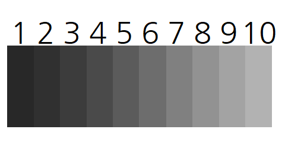
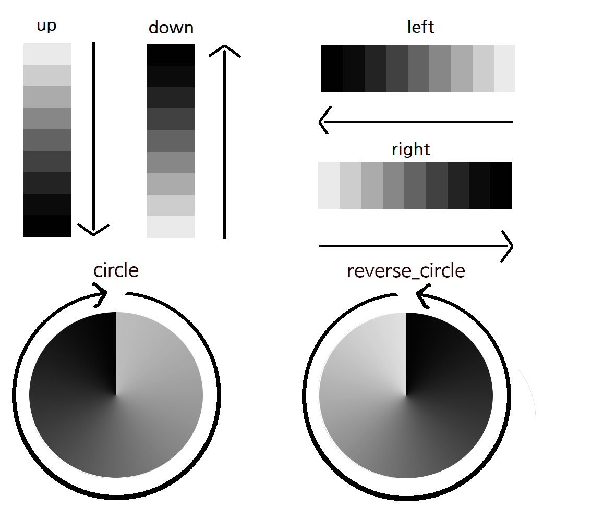
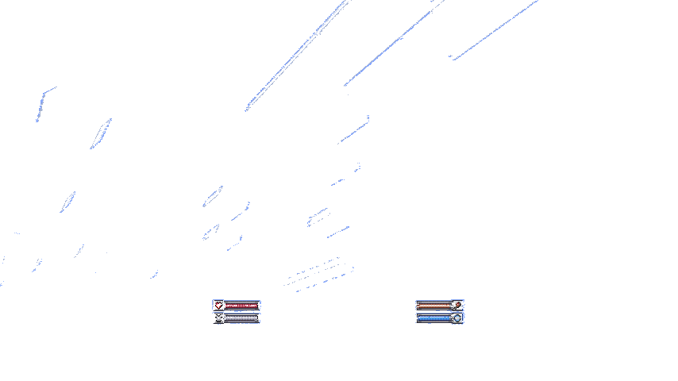

# 图片

取决于图像是单张图片还是监听器。

单张图片用于简单地放置图像，并且是通用的。

监听器用于创建变量条，例如生命值。

## 单张图片

```yaml
image_id:
  type: single
  file: "example.png"
```
你可以在资源文件夹中加载名为“image_id”的example.png文件。


## 监听器
```yaml
health_bar:
  type: listener
  file: "example.png"
  split: 10
  split-type: up
  setting:
    listener:
      class: health
```

### 分割

分割越多，显示的细节越多，但也会增加资源包的容量。

`split: 10`，将创建总共10个资源，如下图所示。



### 分割类型

类型：上、下、左、右、圆形、反向圆形

它们按照下图所示的方向减少。



### 类

内置监听器
```yaml
placeholder (详情如下)
```
例如：[[链接]](placeholders)

### PAPI监听器

如果你找不到你想要的，你仍然可以使用PAPI创建自定义监听器。
```yaml
health_bar:
  type: listener
  file: "example.png"
  split: 10
  split-type: up
  setting:
    listener:
      class: placeholder
      value: "(number)papi:mmocore_health"
      max: "(number)papi:mmocore_max_health"
```
1. 类作为占位符
2. 值是当前值
3. 最大值是最大值的值

PAPI默认是字符串，所以你需要加上(number)前缀

你也可以直接输入一个数字。```max: 1000```

更多细节在[占位符文档](placeholders)中介绍

## 类型：序列
一个动画图像。

每张照片工作1个tick。
```yaml
test_gif:
  type: sequence
  files:
    - test/test_00000.png
    - test/test_00001.png
    - test/test_00002.png
    - test/test_00003.png
    - test/test_00004.png
    - test/test_00005.png
    - test/test_00006.png
    - test/test_00007.png
    - test/test_00008.png
    - test/test_00009.png
    - test/test_00010.png
```
可以按帧设置持续时间。

单位是tick，如下所示
```yaml
test_gif:
  type: sequence
  files:
    - test/test_00000.png:4
    - test/test_00001.png
    - test/test_00002.png:2
```
4个tick，然后1个tick，然后2个tick，依此类推，总共7个tick。

### 堆叠

可以使用此功能实现原版Minecraft HUD。[链接](layouts)
