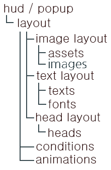

# 布局

布局是文本和图像的分组。

它可以用于HUD或弹出窗口，并具有三种不同的布局。

以下是结构的粗略概念。



（几乎可以对任何元素设置条件。）

## 常见选项
```
layout:
  y: -5
  x: 5
  images:
    1:
      name: example
      x: 10
      y: -10
      scale: 0.5
      layer: 1
```
### 缩放
适用于图像和文本。

你可以增加或减小大小。

默认值：1

例如：`scale: 0.5`

### 渲染缩放

可以独立缩放x坐标和y坐标。

```
render-scale:
  x: 0.5
  y: 0.5
```

### 静态缩放
无论GUI缩放如何，保持相同的大小。

默认值：`false`

### 层
重叠时的显示优先级。

数字越大，优先级越高。

默认值：0

例如：`layer: 1`

### x,y坐标
布局的坐标可以以像素为单位移动。

你可以移动整个布局或单独自定义。

**不支持小数**。

默认值：0

例如：

`x: 10`

`y: -10`

### 对齐
这指的是文本应该如何对齐。

类型：左、中、右

例如：`align: center`


### 不透明度
调整不透明度。

范围：0–1

默认值：`1`

### 颜色覆盖


可以覆盖布局中的颜色。

```
test_layout:
  color-overrides:
    1:
      color: "#FF8080"
  heads:
    ...
```

## 图片布局

```yaml
image_layout:
  images:
    1:
      name: image_id
      scale: 0.5
      x: 5
      y: 10
    2:
    ...
```

加载你在[images](images.md)文件夹中设置的图片。

### 堆叠

```yaml
images
armor_stack_image:
  type: sequence
  files:
   - "armor/empty.png"
   - "armor/half.png"
   - "armor/full.png"

layouts
armor_stack_layout:
  images:
    1:
      name: armor_stack_image
      stack: armor@t / 2
      max-stack: 10
      space: 2
      y: 32
      x: -40
```

用于实现原版Minecraft的HUD。

这是用于生命值、护甲、食物和空气的方法。

每个堆叠占用一个空间。


## 文本布局

```yaml
text_layout:
  texts:
    1:
      name: example_font
      space: 0
      number-format: "#,###.#"
      disable-number-format: false
      use-legacy-format: false
      pattern: "Lv. [mmocore_level]"
      #emoji-scale: 1
      #follow: parties_member_exclude_mine:1
      align: center
      x: 10
      y: -10
      scale: 0.5
      outline: true
      #deserialize-text: true
      #background: test
      #background-scale: 0.6
```

### 名称
指定要使用的[字体](fonts.md)。

如果你遵循文档，字体名为`example_font`。

例如：`name: example_font`

### 间距
调整字符间距。

默认值：`1`

### 数字格式
自动查找并格式化数字，即使它们与文本混合在一起。

DecimalFormat，更多信息请参见wiki。

https://docs.oracle.com/javase/8/docs/api/java/text/DecimalFormat.html

默认值：config.yml - `number-format: "#,###.#"`

### 禁用数字格式
不使用数字格式。

如果为true，则使用'0.###'。

如果可能，建议使用'false'。-编辑者-

默认值：`true`

### 使用数字格式
使用旧版格式。

例如：`&aTest`

如果为false，则用作文本组件的基础。

例如：`<gold><b>Test`

默认值：`true`

### 模板
定义要显示的文本。

可以使用[PAPI](placeholders)，并且可以与纯文本混合使用。

例如：`pattern: "Lv. [mmocore_level]"`

***

还可以在文本中嵌入图像。[字体文档](fonts)

`pattern: "<image:example>"`


***
可以从skript中导入变量。

玩家使用语法'hud player'。

例如：`[skript_variable:%{test::%uuid of hud player%}%]`

***
可以使用`<space:n>`来微调字符之间的间距。

例如：`"test<space:100>layout"`

***
还可以添加颜色和文本格式。

颜色类型：`<#hex>, <black>, <gold>, <gray>, <blue>, <green>, <aqua>, <red>, <yellow>, <white>`

格式类型：`bold <b>, obfuscated <obf>`


### 表情缩放
调整布局中字形的大小。

默认值：`1`

***
布局`scale`选项调整整个布局中的文本和字形，

而字体功能允许您单独调整每个字形的大小。

`emoji-scale`选项调整布局中所有字形的大小。

### 跟随

如果玩家的名字作为PAPI返回，则获取该布局中使用的所有PAPI（pattern、conditions等）的输入玩家信息。

例如：`follow: parties_member_exclude_mine:1`

某些PAPI可以从0开始

`mmocore_party_member_exclude_mine:0`

### 阴影
是否在文本上添加阴影。

如果文本在图像上方，则无法显示阴影。

但是，如果其图层值高于图像，则会显示。

例如：`outline: true`


### 反序列化文本

**注意**

使用此选项可能会导致正常使用中出现问题。

仅在需要外部干预时使用。例如：`skript`

***

这是一个选项，当从外部元素（如PAPI）注入颜色代码时，重新处理和着色。

默认值：`false`

### 背景
```
text_layout:
  texts:
    1:
      ...
      background: example1
      background-scale: 0.6
```
请参阅[背景文档](backgrounds.md)了解如何首先设置此选项。

### 背景缩放
调整背景的缩放比例。

默认值：`1`

### 多行文本


```
test_text:
  texts:
    1:
      ...
      pattern: |
       第1行
       第2行
       第3行
       第4行
       第5行
      #pattern: Minecraft 是一款由 Mojang Studios 开发的 3D 沙盒冒险游戏，玩家可以在一个由方块和实体组成的完全可定制的三维世界中互动。其多样化的游戏玩法允许玩家选择自己的游戏方式，创造出无限的可能性。
      line-align: 居中
      line: 5
      split-width: 300
      line-width: 20
```

可以在 `pattern` 中使用 `\n` 来任意换行。

#### 行数
最多显示多少行多行文本。

默认值：`1`

#### 换行宽度
换行的像素长度。

它与字符数量无关，而是考虑每个字符的像素长度。

#### 行对齐
这指的是多行文本的对齐方式。

类型：`左对齐`, `居中`, `右对齐`

#### 行间距
行与行之间的间距。

## 头部布局
[头部文档](heads.md)
### 跟随
如果玩家的名字返回到 PAPI，则显示该玩家的头部。

例如：`follow: parties_member_exclude_mine:1`

某些 PAPI 可以从 0 开始。

`mmocore_party_member_exclude_mine:0`

### 花哨

头部变为三维效果。


例如：`type: fancy`

## 动画
动画基本上可以通过数学公式组织，并使用 exp4j 库。

[操作文档](operations.md)

这个示例是一个上下移动的动画。
```
example_layout:
  images:
    1:
      name: image_id
  animations:
    type: play_once
    duration: 60
    x-equation: 0
    y-equation: 3cos(t/30 * pi)
```

### 类型

类型：loop(循环), play_once(播放一次)

`默认值：loop`

当设置为 `play_once` 时，它只会运行一次。

