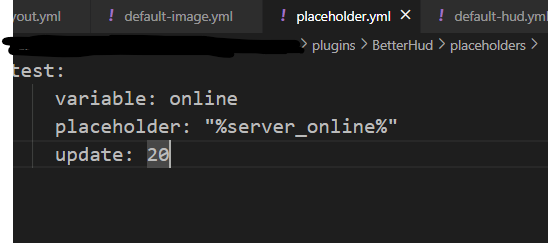

# PAPI

## 如何使用PlaceholderAPI
有同步工作的PAPI和异步工作的一刻锁定的PAPI。

这种方法可能会导致内存泄漏，具体取决于提供PAPI的插件如何处理它。

典型的例子是JavaScript

## 同步PAPI

需要定义一个占位符。

在占位符文件夹中创建一个yml文件，并按图中所示输入。

当`async: true`时异步工作

```
test:
  variable: online
  placeholder: "%server_online%"
  update: 20
  #async: true
```



（update是更新间隔，以刻为单位。）

然后可以以以下格式使用它："[string:online]"

## 异步PAPI
不需要配置任何东西，只需使用"[papi:name]"。

例如`papi:cmi_user_name`

## 内置PAPI
如果可以，这是最推荐的方法。

### Bukkit

#### 默认监听器
```
health
vehicle_health
food
armor
air
exp
absorption
```
####  默认 (返回字符串)
```
name
gamemode
world
```
####  默认 (返回数字)
```
hotbar_slot
health
food
armor
air
max_air
max_health
absorption
max_health_with_absorption
health_percentage
level
last_health
last_health_percentage

potion_effect_duration:name (ex. potion_effect_duration:blindness)

empty_space
total_amount:item_type (ex. total_amount:stone)
storage:item_type (ex. storage:stone)

vehicle_health
vehicle_max_health
vehicle_max_health_with_absorption
vehicle_health_percentage
vehicle_air
vehicle_max_air

popup-index
```
####  默认 (返回布尔值)
```
dead
frozen
has_permission:name (ex. has_permission:hud.hud)

has_main_hand
has_off_hand
```
#### MMOCore 监听器
```
mmocore_mana
mmocore_stamina
mmocore_stellium
mmocore_experience
mmocore_cooldown_slot
mmocore_cooldown_skill
```
#### MMOCore (返回字符串)
```
mmocore_class
mmocore_guild_id
mmocore_guild_name
mmocore_skill_name:arg
mmocore_party_member:number
mmocore_party_member_exclude_mine:number
```

#### MMOCore (返回数字)
```
mmocore_mana
mmocore_max_mana
mmocore_mana_percentage
mmocore_stamina
mmocore_max_stamina
mmocore_stamina_percentage
mmocore_stellium
mmocore_max_stellium
mmocore_stellium_percentage
mmocore_party_count / mmocore_party_member_count
mmocore_guild_member_count
mmocore_exp
mmocore_max_exp
mmocore_level
mmocore_stat:arg
mmocore_temp_stat:arg
mmocore_claims:arg
mmocore_current_cooldown_slot:arg
mmocore_current_cooldown_skill:arg
mmocore_required_mana_skill:arg
mmocore_required_stamina_skill:arg
mmocore_skill_bound_index:arg
mmocore_skill_level:arg
mmocore_casting_slot:arg
```

#### MMOCore (返回布尔值)
```
mmocore_is_casting_mode
mmocore_bounded_skill:arg
mmocore_bounded_slot:arg
```

#### MMOItems (返回字符串)
```
mmoitems_mainhand_skill:mode (ex. mmoitems_mainhand_skill:LEFT_CLICK)
```

#### MythicMobs (返回字符串)
```
mythicmobs_caster_variable:arg
mythicmobs_target_variable:arg
mythicmobs_world_variable:arg
```

#### MythicMobs (返回数字)
```
mythicmobs_current_cooldown:arg
mythicmobs_aura_stack:arg
mythicmobs_aura_max_duration:arg
mythicmobs_aura_duration:arg
mythicmobs_aura_duration_reversed:arg

```

#### MythicMobs (返回布尔值)
```
mythicmobs_has_aura:arg
mythicmobs_is_mythicmob
```

#### WorldGuard (返回布尔值)
```
worldguard_in_region:name
```

#### Vault (返回数字)
```
vault_money
```

#### Skript (返回字符串)
```
skript_variable:variable (ex. skript_variable:%{test::%uuid of hud player%}%)
```

#### Parties (返回字符串)
```
parties_member:number
parties_member_exclude_mine:number
```

#### Parties (返回布尔值)
```
parties_is_leader
```

### Fabric
#### 默认监听器
```
health
vehicle_health
food
armor
air
exp
absorption
```

####  默认 (返回字符串)
```
name
gamemode
world
```

####  默认 (返回数字)
```
hotbar_slot

health
food
armor
max_health
absorption
max_health_with_absorption
health_percentage
last_health
last_health_percentage

level
air
max_air

potion_effect_duration:arg

vehicle_health
vehicle_max_health
vehicle_max_health_with_absorption
vehicle_health_percentage

vehicle_air
vehicle_max_air

popup-index
```

####  默认 (返回布尔值)
```
dead
frozen
has_permission:arg

has_main_hand
has_off_hand
```

#### [placeholder-api (返回字符串)](https://modrinth.com/mod/placeholder-api)
```
placeholder_api_parse:arg
```

### Velocity
####  默认 (返回字符串)
```
name
```
####  默认 (返回数字)
```
ping
```