# 入门教程

在开始之前，无法帮助应用资源包，但如果使用ItemsAdder或Oraxen，可以帮助设置它们。

[如何安装](How-to-install.md)

并将以Vault作为经济插件的示例，所以如果可以的话请安装它。

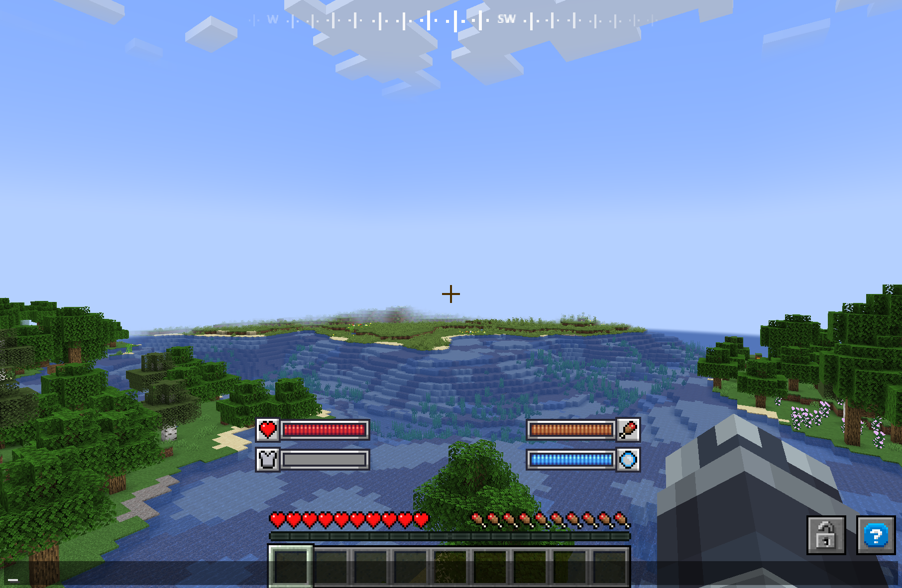

如果成功应用了资源包，你应该会看到类似这样的内容。

将应用图像、布局、头像和一些功能。

## 1. 应用字体
首先，将获取一个TTF字体并应用它。

1. 将扩展名为ttf和otf的文件放入fonts文件夹中。

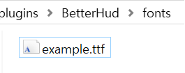

2. 在texts文件夹中创建一个yml文件
   （你可以随意命名你创建的所有文件。）

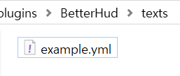

3. 在“texts/example.yml”中，输入以下内容
```
example_font:
  file: example.ttf
  scale: 16
```

更多信息，请参见以下[链接](feature/fonts.md)

## 2-1. 在屏幕上放置文本
1. 在layouts文件夹中创建yml文件。

2. 输入以下内容

```
example_layout:
  texts:
    1:
      name: example_font
      pattern: "text"
      x: 0
      y: 0
```
当设置上面的字体时，我们将字体ID设置为'example_font'

name是要使用的字体，pattern是要放入其中的内容。

同样，布局的ID为'example_layout'

无法直接在屏幕上查看，因此需要设置hud或弹出来输出它。

3. 在huds文件夹中创建yml文件并输入以下内容
```
example_hud:
  layouts:
    1:
      name: example_layout
      x: 50
      y: 50
```
在hud文件中，name指的是要输出的布局ID。

坐标简单地表示它居中，更多信息请阅读功能wiki。

4. 在config.yml中添加一行并执行“/hud reload”
```
default-hud:
- test_hud
- example_hud
```
这是默认显示的hud。

5. 然后重新应用资源包。如果你使用ItemsAdder，请输入“/iazip”

6. 看起来很棒！要了解更多关于文本布局的信息，请查看[wiki](feature/layouts.md)
   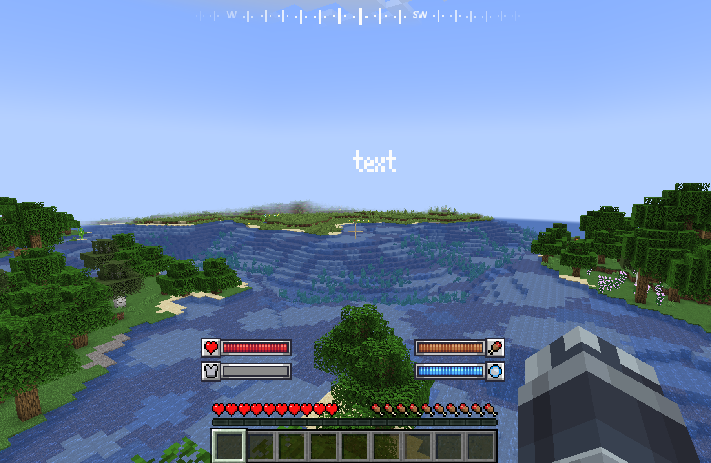

## 2-2. 输出PlaceholderAPI
1. 再次返回布局并修改pattern内容。
   vault_money
```
pattern: "[vault_money]"
```
这是BetterHud内置的PAPI，更多信息请参见以下[链接](feature/placeholders.md)

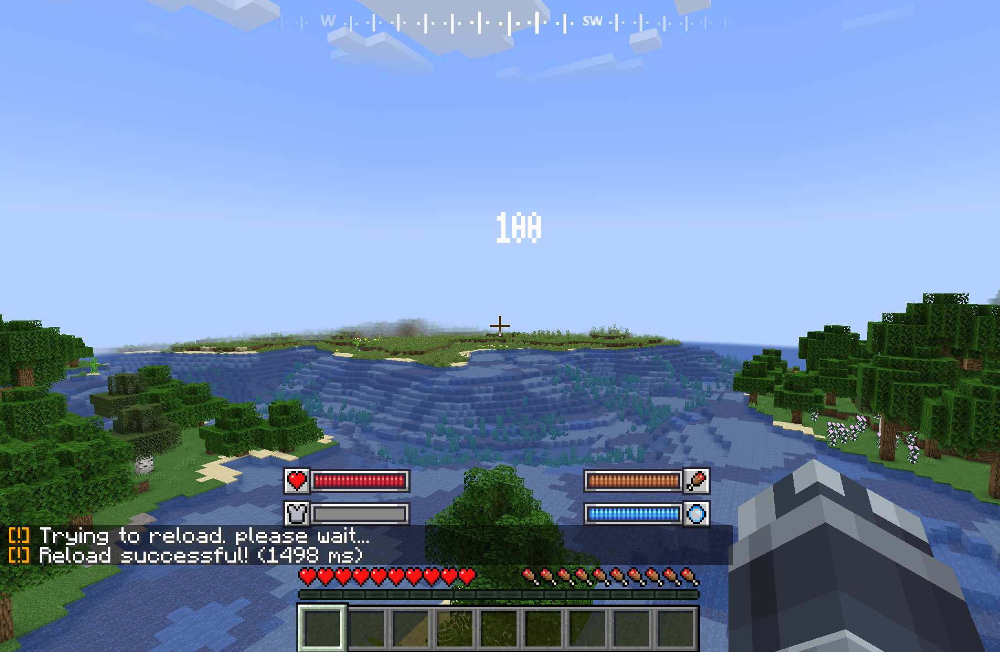

2. 很好，patterns可以混合papi和纯文本。像这样设置
```
pattern: "[vault_money]$"
```

如果你执行“/hud reload”，它看起来会像这样。
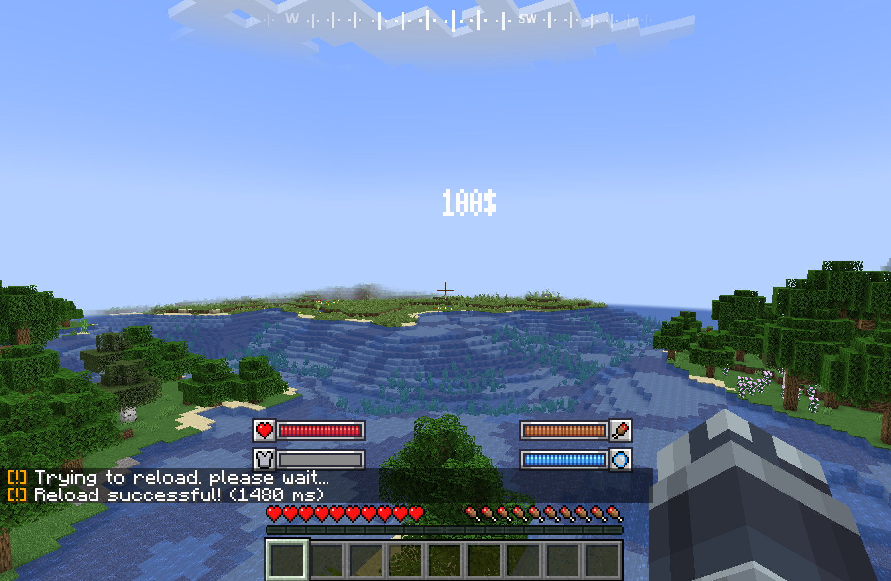

3. 让我们使用操作功能。
```
pattern: "[vault_money@t + 50]$"
```
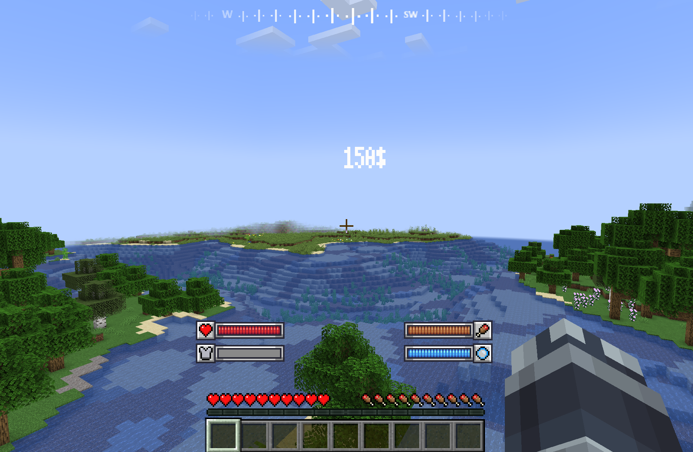

不会用它来显示金钱，但会找到很多用途。[[wiki]](feature/operations)

## 3. 在屏幕上放置图像

让我们从hud中默认存在的图像开始。

就像处理字体、布局和hud一样，我们需要给图像一个ID。

省略了图像，但你可以将其放入你的assets文件夹中。

1. 在images文件夹中创建一个yml文件，并填写以下内容
```example_image:
  type: single
  file: air_bar.png
```

2. 回到布局中，输入以下内容
```example_layout:
  texts:
    1:
      name: example_font
      pattern: "[vault_money@t + 50]$"
      x: 0
      y: 0
  images:
    1:
      name: example_image
      x: 0
      y: -10
```
对于x坐标，只需执行“/hud reload”，但需要重新应用资源包来调整y坐标。

3. 在“/hud reload”后重新应用资源包

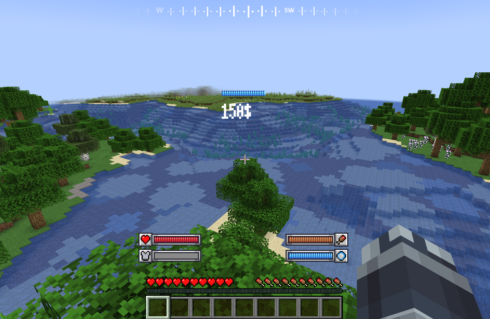

## 4. 将头像放在屏幕上
如果你已经做到这一步，你应该对HUD的结构有了基本的了解。

是的，事情就是这样。

1. 在你的heads文件夹中创建一个yml文件，并输入以下内容

pixel选项表示头像像素的大小。
```example_head:
  pixel: 4
```

2. 回到布局中，输入以下内容
```example_layout:
  texts:
    1:
      name: example_font
      pattern: "[vault_money@t + 50]$"
      x: 0
      y: 0
  images:
    1:
      name: example_image
      x: 0
      y: -10
  heads:
    0:
      name: example_head
      x: 0
      y: 20
```

3. 在“/hud reload”后重新应用资源包
   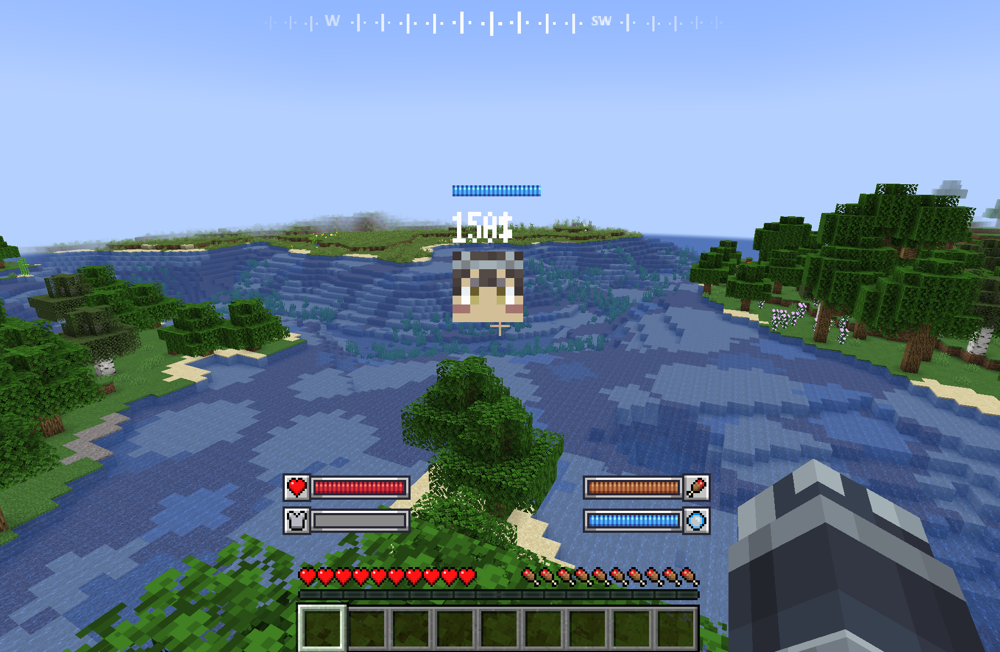

## 5. 无论GUI比例如何，固定位置


如果hud中的坐标数字不是0、50或100，比例就会扭曲。

有关原因的更多信息，请参见以下[wiki](feature/huds)

稍后会看到原因，但现在，让我们将头像固定在左上角。

1. 分离头像的布局并将其y坐标调整为0。
```example_layout:
  texts:
    1:
      name: example_font
      pattern: "[vault_money@t + 50]$"
      x: 0
      y: 0
  images:
    1:
      name: example_image
      x: 0
      y: -10
      
head_layout:
  heads:
    0:
      name: example_head
      x: 0
      y: 0
```

2. 导航到你的HUD文件并输入以下内容
```example_hud:
  layouts:
    1:
      name: example_layout
      x: 50
      y: 50

head_hud:
  layouts:
    1:
      name: head_layout
      x: 0
      y: 0
```

你之前已经看到了如何注册默认值，所以注册它们

2. 当我们重新应用资源包时...
   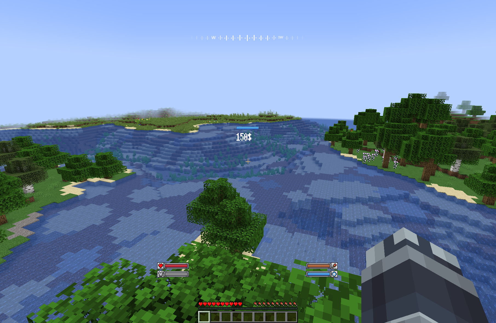

是的。它很可能消失了。

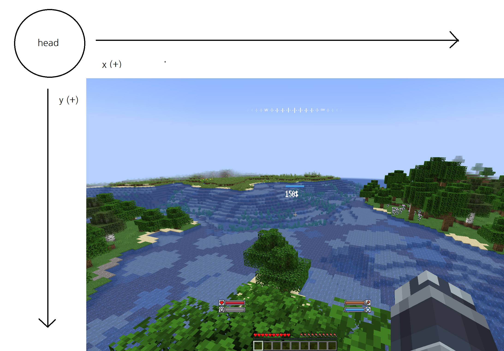

但它并没有真正消失，它只是在屏幕外做了一些事情。

3. 调整布局的坐标。
```head_layout:
  heads:
    0:
      name: example_head
      x: 8
      y: 60
```

4. 在“/hud reload”后重新应用资源包

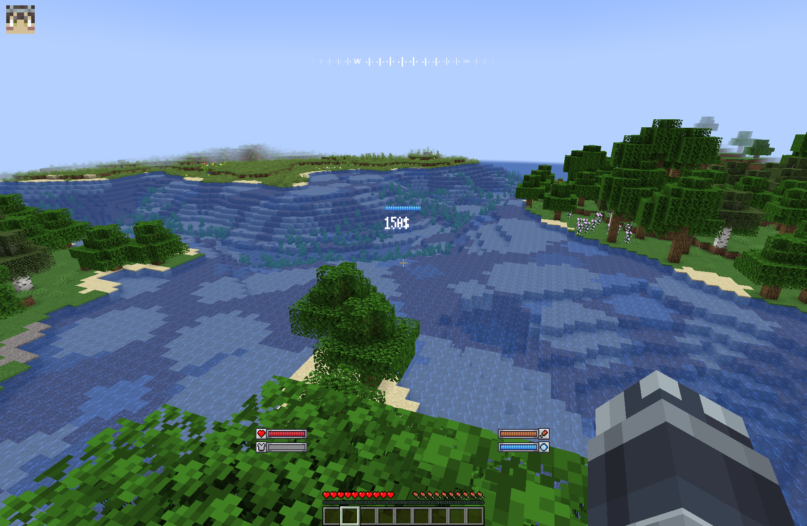

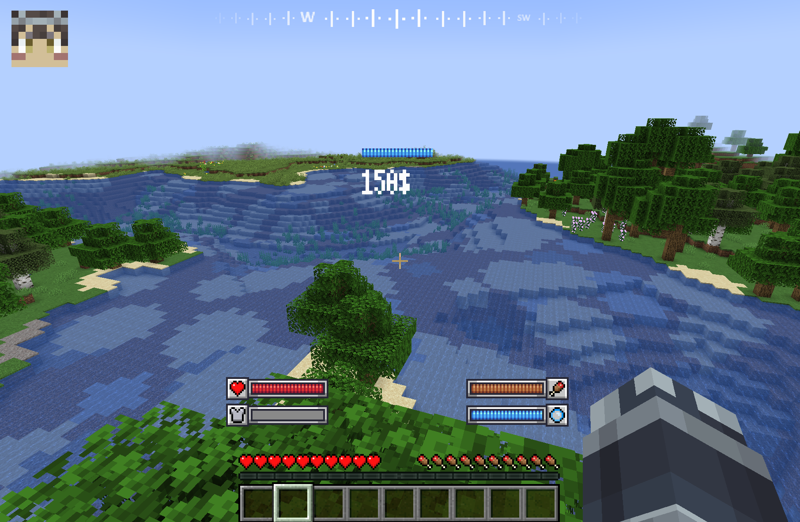

当GUI比例改变时，位置保持不变。

## 结束

你应该对BetterHud的结构有了很好的了解。

阅读功能wiki，然后自己尝试其他功能。