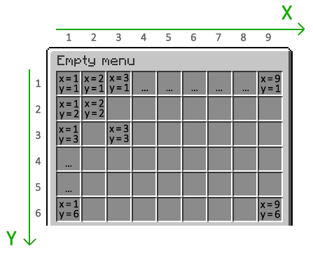

# 物品属性

如 Menu icons 部分所示，属性修改图标的材质和位置

必须写的的属性包括：

- `MATERIAL`
- `POSITION-X`
- `POSITION-Y`


## `MATERIAL`

数据类型: string

你可以将 material 设置为 `air` 来做空格子，因为它依旧可以被点击

:::warning

插件的 MATERIAL 名称与原版的不同

:::

每个版本的有效material列表 (不要使用前缀为LEGACY_的material)：

- [1.16](https://helpch.at/docs/1.16.1/org/bukkit/Material.html)
- [1.15](https://helpch.at/docs/1.15/org/bukkit/Material.html)
- [1.14](https://helpch.at/docs/1.14/org/bukkit/Material.html)
- [1.13](https://helpch.at/docs/1.13/org/bukkit/Material.html) (和1.12相比改动很大)
- [1.12](https://helpch.at/docs/1.12/org/bukkit/Material.html)
- [1.11](https://helpch.at/docs/1.11/org/bukkit/Material.html)
- [1.10](https://helpch.at/docs/1.10/org/bukkit/Material.html)
- [1.9](https://helpch.at/docs/1.9/org/bukkit/Material.html)
- [1.8](https://helpch.at/docs/1.8/org/bukkit/Material.html)

例子:
```
MATERIAL: diamond sword
```


`POSITION-X` 和 `POSITION-Y`

数据类型: integer

这是物品在菜单中的显示位置

POSITION-X是列(从左到右，值 1-9)，POSITION-Y是行(从上到下，值 1-行数)


使用此表可以很容易地找到你想要的坐标：



例子:
```
POSITION-X: 5
POSITION-Y: 1
```

## `ACTIONS`

数据类型: list

玩家点击后执行动作的列表，像例子这样没有前缀就是直接执行命令

更多的动作见 [点击动作](/chest-command/基础/点击动作.md)

例子:
```
ACTIONS:
  - 'spawn'
```

## `NAME`

数据类型: string

物品名称 可以使用颜色、[symbols](/chest-command/symbols.md)和[占位符](/chest-command/基础/占位符.md)

例子:
```
NAME: '&6This is a colored name!'
```

## `LORE`

数据类型: list

物品lore 可以使用颜色、[symbols](/chest-command/symbols.md)和[占位符](/chest-command/基础/占位符.md)

例子:
```
LORE:
- 'Description of the item'
- 'on multiple lines'
```

## `DURABILITY`

数据类型: integer

别名: DURABILITY

物品损伤值

例子 (掉耐久的盔甲):
```
MATERIAL: diamond helmet
DURABILITY: 150
```

Minecraft 1.12及更早版本的示例(黄色羊毛):
```
MATERIAL: wool
DURABILITY: 4
```

## `AMOUNT`

数据类型: integer

物品数量

例子:
```
AMOUNT: 12
```

## `NBT-DATA`

数据类型: string

例子 (icon 必须是一个头颅):

```
# (Minecraft 1.16+)
NBT-DATA: '\{SkullOwner:\{Id:[I;-2118090499,36390780,-1625030656,16135986],Properties:\{textures:[\{Value:"eyJ0ZXh0dXJlcyI6eyJTS0lOIjp7InVybCI6Imh0dHA6Ly90ZXh0dXJlcy5taW5lY3JhZnQubmV0L3RleHR1cmUvOGFlNTJhZThjOThhYzE5ZmQwNzYzN2E0NjlmZmEyNTZhYjBiM2IxMGVjZTYyNDMxODYxODhiYTM4ZGYxNTQifX19"\}]\}\}\}'

# (Minecraft 1.8 - 1.15)
NBT-DATA: '\{SkullOwner:\{Id:"81c080fd-022b-477c-9f24-f63732",Properties:\{textures:[\{Value:"eyJ0ZXh0dXJlcyI6eyJTS0lOIjp7InVybCI6Imh0dHA6Ly90ZXh0dXJlcy5taW5lY3JhZnQubmV0L3RleHR1cmUvOGFlNTJhZThjOThhYzE5ZmQwNzYzN2E0NjlmZmEyNTZhYjBiM2IxMGVjZTYyNDMxODYxODhiYTM4ZGYxNTQifX19"\}]\}\}\}'
```

例子(通过NBT而不是ENCHANMENTS来设置附魔):
```
NBT-DATA: '\{Enchantments:[\{id:"minecraft:sharpness",lvl:3\}],HideFlags:62\}'
```

## `ENCHANTMENTS`

数据类型: list

为 icon 添加附魔

每个元素的格式： `<enchantment>, [level]`

其中 `[level]` 为选填

例子:
```
ENCHANTMENTS:
  - sharpness, 5
  - silk touch
  - durability, 10
```

## `COLOR`

数据类型: string

设置皮革装备的颜色

格式: `<red>, <green>, <blue>` 取值在 0 and 255 之间

其实就是RGB颜色

例子:
```
COLOR: '255, 0, 0'
```

## `SKULL-OWNER`

数据类型: string

设置 icon 的头颅皮肤（必须是玩家的头）

可以使用\{player\}占位符作为值来显示查看菜单的玩家的头。如果要显示自定义纹理，则应使用 `NBT-DATA`

例子 (icon 必须是头颅):
```
SKULL-OWNER: '\{player\}'
```

## `BANNER-COLOR`

数据类型: string

设置旗帜的颜色。值必须是燃料颜色([list of valid dye colors](https://hub.spigotmc.org/javadocs/spigot/org/bukkit/DyeColor.html))

:::info

该属性仅适用于Minecraft 1.12及更早版本，当时没有为每个旗帜颜色单独的材质。

:::

Example (icon 必须是旗帜):
```
BANNER-COLOR: 'light_blue'
```

## `BANNER-PATTERNS`

数据类型: list

设置旗帜图案

格式: `<pattern>:<color>`

`<pattern>` -> [list of valid pattern types](https://hub.spigotmc.org/javadocs/spigot/org/bukkit/block/banner/PatternType.html)

`<color>` -> [list of valid dye colors](https://hub.spigotmc.org/javadocs/spigot/org/bukkit/DyeColor.html)

例子 (icon 必须是旗帜)
```
BANNER-PATTERNS:
  - 'cross:yellow'
  - 'border:red'
```

## `PRICE`

数据类型: decimal

执行此icon的点击动作需要的money

需要配置 [经济](/chest-command/基础/安装.md)

例子:
```
PRICE: 100.0
```

## `LEVELS`

数据类型: integer

例子:
```
LEVELS: 5
```

## `REQUIRED-ITEMS`

数据类型: list

执行 icon 的点击动作需要的物品

格式: `<material>:[durability], [amount]`

`<material>` 必写 其他可选

Minecraft 1.13及更新版本的示例(30黄色羊毛):
```
REQUIRED-ITEMS:
  - 'yellow wool, 30'
```

Minecraft 1.12及更早版本的示例(30黄色羊毛):
```
REQUIRED-ITEMS:
  - 'wool:4, 30'
```

## `KEEP-OPEN`

数据类型: boolean

设置单击 icon 后是否应关闭菜单 默认值为false(单击后菜单将关闭)

例子:
```
KEEP-OPEN: true
```

## `PERMISSION`

数据类型: string

设置点击 icon 执行动作需要的权限

例子 (肯定 检查玩家拥有权限):
```
PERMISSION: 'my.custom.permission'
```
例子 (否定 检查玩家没有权限):
```
PERMISSION: '-my.custom.permission'
```

## `VIEW-PERMISSION`

数据类型: string

可视权限(可以被`OERMISSION`否定)

例子:
```
VIEW-PERMISSION: 'my.custom.permission'
```

## `PERMISSION-MESSAGE`

数据类型: string

点击 icon 后 给没有权限的人发送的消息

如果未设置将发送 config.yml 中的默认消息

例子:
```
PERMISSION-MESSAGE: '&cYou must be VIP to use this.'
```