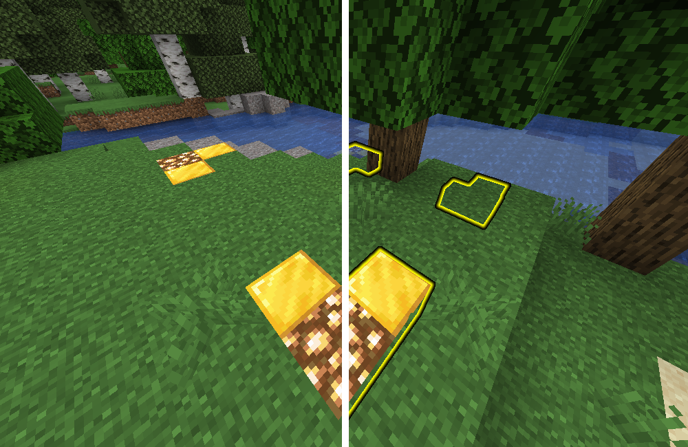
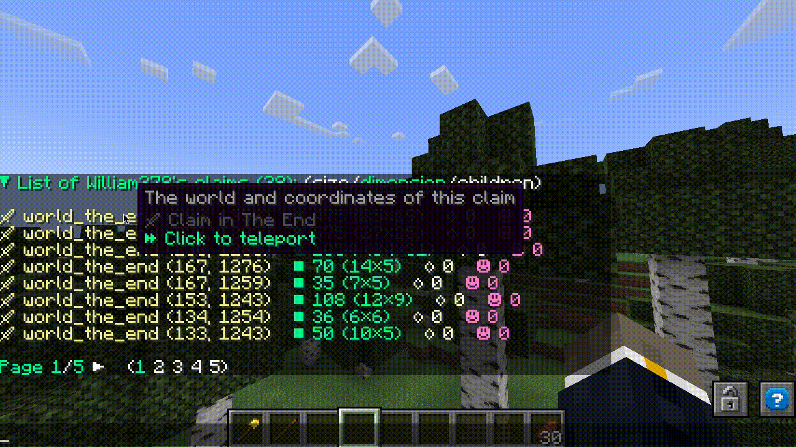

# 领地

领地是玩家拥有的矩形区域，这些区域受到保护，防止他人破坏。创建和扩展领地需要消耗[[领地方块]]，并且领地会延伸到世界的整个高度。

## 创建领地
创建领地需要领地工具，默认情况下是金铲子。要创建领地，只需右键点击一个方块以标记领地的第一个角落，然后右键点击第二个方块以标记对角线的另一个角落。在两个角落之间的矩形区域将形成一个领地。

也可以通过使用`/claim (半径)`命令来创建领地，该命令将在玩家当前位置周围创建一个半径为`(半径)`方块的领地。领地有最小尺寸和面积，可在插件[[配置]]中进行配置。

## 检查领地
检查领地使用检查工具，默认情况下是木棍。只需右键点击木棍来检查某个方块是否已被领地覆盖。不同类型的领地将以不同的发光方块显示（Paper 1.19.4+）/幽灵方块（Spigot 1.19.4及以下）进行高亮显示。

在右键点击时按住潜行键将检查附近的所有领地，高亮显示在可配置半径内的所有领地。

在启用`block_displays`设置的Minecraft 1.19.4+ Paper服务器上，领地检查将使用方块显示实体来高亮显示领地，提供发光方块以提高可见性。在较旧的服务器上，或禁用`block_displays`设置时（如果您愿意！），将使用“幽灵方块”代替。

## 列出领地
您可以使用`/claimslist`命令查看您的领地列表，该列表可通过交互式可点击聊天按钮进行导航。在跨服务器模式下运行HuskClaims的服务器上，领地列表是全局的。

管理员可以使用`/adminclaimslist`命令查看[管理员领地](#管理员领地)列表，并通过`/claimslist (用户名)`查看特定用户的领地。此外，如果启用了HuskHooks插件，拥有`/huskclaims teleport`权限的管理员可以点击领地列表中显示的坐标，快速传送到该领地。

## 调整大小和删除领地
要调整领地大小，请按住领地工具并右键点击您希望调整大小的领地的角落。然后，右键点击新的角落点以调整领地大小。

领地所有者可以使用`/unclaim`命令删除他们的领地。这将退还玩家用于创建领地的领地方块。如果您站在一个有子领地的父领地中，这些子领地也将被删除；系统将提示您确认此操作。`/unclaimall`命令也可用于执行批量删除操作，删除玩家拥有的所有领地。

## 领地内的操作
领地内的操作仅限于在领地内拥有[[信任]]的用户（管理员领地除外&mdash;[见下文](#管理员领地)），不同的信任级别允许用户执行不同的操作。

与领地/操作系统分开，驯服的动物可以通过[[宠物]]系统免受伤害。

### 自然操作
在领地内，自然事件&mdash;如作物生长和生物生成&mdash;可能会发生，具体取决于服务器管理员设置的默认标志（请参阅`config.yml`中的`default_flags`、`admin_flags`和`wilderness_flags`部分）。但是，您可以使用[[操作组]]来切换某些行为；默认情况下，`/claimexplosions (on|off)`命令允许领地管理者和所有者切换是否允许领地内的爆炸伤害。

### 忽略领地
使用`/ignoreclaims (on|off)`命令，管理员可以切换是否希望忽略领地操作限制；在忽略领地时，管理员将能够在任何领地内执行任何操作，无论他们在该领地内的信任级别如何。

## 子领地
子领地（也称为“细分”）本质上是领地内的领地。这对于城镇项目非常有用，您可能希望限制玩家可以在领地的哪个区域建造。子领地首先通过使用`/childclaim`命令切换子领地创建模式来创建，然后在父领地内右键点击两个角落点以创建子领地。`/childclaim (半径)`命令也有效，前提是您站在父领地内且半径足够小以适合其中。创建和管理子领地需要在父领地中拥有`MANAGE_CHILD_CLAIMS`权限。

默认情况下，子领地继承父领地的[[信任]]访问列表，这意味着在父领地中受信任的用户也将有权访问子领地&mdash;但反之则不然。所有者可以使用`/restrictclaim (on|off)`切换命令限制访问继承。

## 管理员领地
管理员领地是特殊的领地，不属于任何玩家，并且不受与普通领地相同的限制。管理员领地首先通过使用`/adminclaim`命令切换管理员领地创建模式来创建，然后右键点击两个角落点以创建领地。`/adminclaim (半径)`命令也有效，如果您更喜欢径向领地创建。

与普通领地不同，所有拥有`huskclaims.admin_claim`权限的管理员在每个管理员领地中都有完全的管理权限，允许他们在不被明确信任的情况下信任自己并创建子领地。

## 防止公共导航
通过启用领地禁令和/或私人领地功能，您可以选择禁止人们进入领地并将其设为私人，以防止人们能够进入。

### 领地禁令
如果您启用了领地禁令（请参阅[[配置]]中`claims`下的`bans`子部分），您可以使用`/claimban <ban|unban|list> [用户名]`命令在领地或子领地中禁止和取消禁止玩家。这需要`MANAGE_BANS`领地权限。

这将防止被禁止的玩家进入领地/子领地。被禁止的玩家不能在领地中受信任，并且无法与领地内的方块互动。

### 私人领地
如果您启用了私人领地（该选项位于[[配置]]中`claims`下的`bans`子部分），拥有`MAKE_PRIVATE`领地权限的用户可以使用`/claimprivate (on|off)`切换命令将领地或子领地设为私人。只有在领地中拥有[信任级别](trust#trust-levels)的用户才能进入。