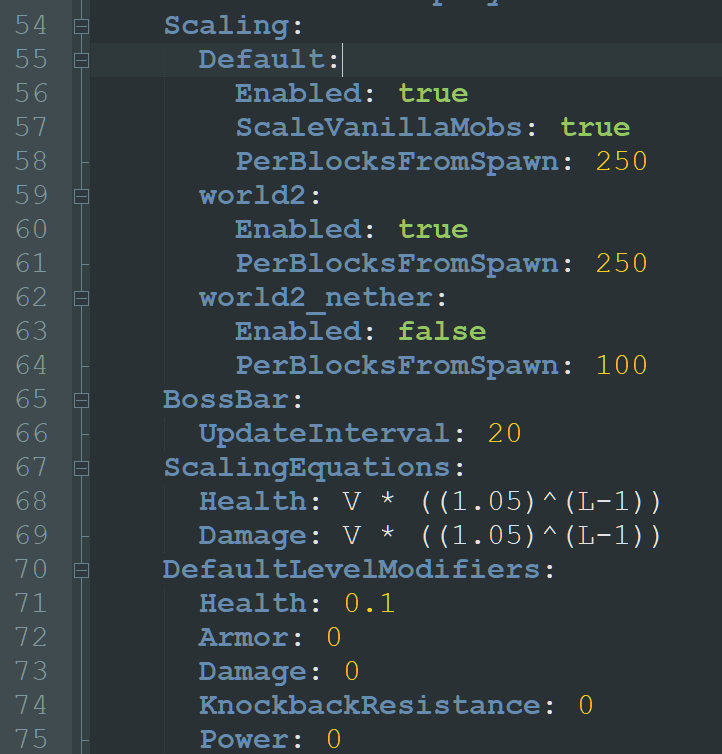

# 🗣️ 常见问题解答

<details>

<summary>如何在某些世界或某些生物中启用或禁用LevelledMobs？</summary>


```yaml
  conditions:
    worlds: ['*']
    #biomes: ['*']
    entities: ['*']
```


作为**默认规则**的一部分，在您的`rules.yml`文件中，找到上述配置选项。

您可以通过编辑这些设置来更改哪些世界被`包含`或`排除`。

例如，如果您希望LevelledMobs在_所有世界中生效，除了一个名为`player_farms`的世界_，那么您可以将`worlds:`更改为：


```yaml
worlds:
  excluded-list: ['player_farms']
```


再举一个例子，如果您希望LevelledMobs仅在名为`danger_zone`的世界中生效，那么您可以将`worlds:`更改为：

```yaml
worlds:
  included-list: ['player_farms']
```

同样的方法也适用于_实体_。

</details>


<details>

<summary>LevelledMobs会阻止生物生成吗？</summary>

**从未有过，也永远不会**

这是我们插件自诞生以来的政策。

我们有意避免任何影响`mobQueue`或改变生成速率、机制或行为的操作。我们很早就认识到，这是许多插件在相同或类似功能上产生冲突的根源。

一般来说，LevelledMobs的工作方式是通过使用广泛的监听系统，监听区块加载、实体生成、伤害事件等。如果LevelledMobs检测到一个生物，它将首先确定该生物是否已完成“生成”。如果已完成，它将根据当前规则集确定该生物是否应获得等级。如果是，LevelledMobs将在生物本身上存储大量数据，这些数据包含LevelledMobs用于识别和修改实体的许多设置。如果实体由于任何原因不允许被升级，那么该实体将移除LevelledMobs的大部分数据，并被插件忽略，直到它变得可升级（由于规则或环境/条件检查的变化）。&#x20;

</details>


<details>

<summary>LevelledMobs会使我的服务器卡顿吗？我的Spark/Profiler报告显示您的插件使用了大量资源？！</summary>

极不可能！

即使在资源非常紧张的服务器上，我们也几乎没有遇到卡顿问题。我们还与一些使用我们插件的服务器所有者保持联系，他们的玩家数量从50到400不等，这些实际测试的结果表明，我们的插件在典型和非典型服务器环境下都表现出色。\
\
在每次重大更新中，我们都会进行压力测试，涵盖名称标签、自定义掉落和策略计算系统；这是我们使用的三个最耗费资源的系统。即使在数千个生物存在于一个小区域内，并且多个玩家同时处理独特的等级策略和随机损坏的盔甲选择的情况下，也没有明显的卡顿或TPS下降。

特别是关于Spark和Profiler报告；这些几乎总是对报告内容的误解。在四年的开发过程中，我不记得有任何一次公众提交的报告代表了一个有效的问题。如果您具备分析这些报告的知识基础，我们鼓励您报告您可能发现的任何问题。否则，我们建议您检查更合适的区域以获取有关服务器性能问题的支持。

</details>


<details>

<summary>LevelledMobs支持哪些服务器软件？</summary>

请阅读[安装指南](installation.md)。

</details>


<details>

<summary>LevelledMobs会增加玩家的经验值或物品吗？</summary>

是的！

默认情况下，当生物达到最高等级时，物品掉落率增加300%，经验值增加500%。这些值可以在配置中更改，完全移除，或者与**区块内死亡限制器**结合使用，将该功能置于冷却状态。

升级后的生物拥有更高的生命值、伤害输出和速度；这使得它们值得通过额外的经验值或物品来奖励。如果您或您的服务器不同意，您可以编辑上述任何值。

</details>

<details>
<summary>如何移除被动生物的姓名标签？</summary>

在你的默认`rules.yml`文件中找到以下（或类似的）自定义规则：

```yaml
  - custom-rule: 'Reduced Nametag Visibility'
    is-enabled: true
    conditions:
      entities:
        included-groups: [ 'all_passive_mobs' ]
        included-list: [ 'BAT' ]
        excluded-list: [ 'IRON_GOLEM' ]
    settings:
      nametag-visibility-method: [ 'MELEE', 'ATTACKED' ]
```

并将_姓名标签可见性方法_更改为`nametag-visibility-method: DISABLED`。

这将禁用所有被动生物以及蝙蝠的姓名标签功能（因为蝙蝠在Minecraft的标准中奇怪地不被视为被动生物）。

* 自`4.0.5 b23`版本起，一旦姓名标签被禁用，可能需要玩家重新登录以更新姓名标签为不可见。

</details>

<details>

<summary>如何更改生物的掉落物？</summary>

使用我们的[自定义掉落物](../the-default-files/customdrops.yml/)系统！

自定义掉落物功能提供了一个易于使用、易于扩展的配置，允许你为生物创建物品列表或表格。这些物品可以设置为掉落物、可穿戴装备或放置在生物手中的可用物品。你可以通过命令、多个支持的第三方插件的物品、原版物品等方式奖励玩家；并根据任何数量和组合的因素调整输出。

建议通过创建掉落表来使用自定义掉落物系统，然后通过自定义规则实现这些掉落表。你可以在示例自定义规则中看到一个例子。

</details>

<details>

<summary>有哪些可用的升级策略？</summary>

在LevelledMobs4中，你可以将多个升级_策略_组合在一起形成最终的数值等级，或单独使用每个策略。

* **加权随机**（默认启用）\
  使用随机选择方法，其中最高等级的可能性最低，最低等级的可能性最高。\
  这可以修改为随机选择设置特定等级的权重。
* **随机**\
  这是真正的随机升级。可以选择最小值和最大值之间的任何等级。
* **距离原点**\
  以前称为_距离出生点_，此策略允许你建立一个中心点，并从该点逐渐扩展的环将根据你的距离设置逐渐增加生物的等级值。LM3中的_blended_附加组件已并入LM4的主要设置中，允许高于或低于某个阈值的高度影响最终输出数字（默认情况下，洞穴中的值较高，山脉中的值较低）。适用于像末地这样更广阔的世界。
* **Y坐标**（默认启用）\
  此策略采用起始世界高度并在该高度及更高处设置最低可用等级，然后采用结束世界高度并在该高度及更低处设置最高可用等级。适用于像下界这样更垂直的世界。

此外，还有多个_修饰符_可以应用额外的度量来调整最终应用于生物的等级。

* **玩家等级修饰符**（默认启用）\
  以前称为_玩家变量升级_策略，此修饰符可以获取其他第三方插件生成的PlaceholderAPI \[PAPI]占位符标签，以及我们自己的内部占位符，并将它们组合起来形成调整生物等级的数值基础。
* **随机方差修饰符**（默认启用）\
  此修饰符简单地在已建立的值之间选择一个随机数字；适用于对最终应用的等级应用随机程度的方差。

</details>

<details>

<summary>如何更改生物的难度？生物太难了？！</summary>

我们提供了五种独特且经过游戏测试的升级_挑战_，你可以轻松地在它们之间切换。

```yaml
    #===== 选择一个挑战 =====
    #- challenge-vanilla
    #- challenge-bronze
    - challenge-silver
    #- challenge-gold
    #- challenge-platinum
    #- challenge-formula
```

默认情况下，我们使用_白银挑战_。你可以切换到_青铜_挑战以降低难度，或切换到_黄金_或_白金_挑战，这需要技巧来处理。\
或者你可以通过复制任何其他预设并为其赋予一个独特的名称来制作你自己的_挑战_ **预设**，然后调整属性值以适应你服务器的需求。

</details>

<details>

<summary>如何切换到不同的等级策略？</summary>

使用LevelledMobs4，您可以将多个等级策略组合在一起，形成最终的数值等级，或者单独使用每个策略。

每个策略都会生成自己的占位符标签，代表该策略的输出。例如，策略类型_distance-from-origin_会生成一个内部使用的占位符标签`%distance-from-origin%`，该标签输出该策略的数值。

在**默认规则**下，我们包含了几个预设，可以轻松启用或禁用以激活或停用不同的策略。

```yaml
    #===== 选择策略 =====
    #- lvlstrategy-random
    - lvlstrategy-weighted-random
    #- lvlstrategy-distance-from-origin
    - lvlstrategy-y-coordinate

    #===== 选择修饰符 =====
    - lvlmodifier-player-variable
    - lvlmodifier-random-variance
```

只需删除或添加`#`即可启用或禁用不同的策略预设。

一旦您确定了策略，找到**默认规则**下的`construct-level:`并修改它，使其仅包含已激活的策略以及您希望这些策略的输出如何反映。

```yaml
construct-level: '(%weighted-random% / 2) + (%y-coordinate% / 5) + %player-variable-mod% + %random-variance-mod%'
```

例如，如果我只启用了`lvlstrategy-weighted-random`和`lvlmodifier-random-variance`，那么我可能会更改`construct-level:`以反映这一变化：

```yaml
construct-level: '(%weighted-random% / %random-variance-mod%) + %random-variance-mod%'
```

</details>


<details>

<summary>如何使插件X中的生物具有等级？</summary>

使用LevelledMobs4，我们包含了新的`externalplugins.yml`文件。这允许您通过提供常用的插件特定标识符来建立自己的外部插件支持，这些标识符位于生物的PersistentDataContainer \[PDC]或其元数据中。

</details>


<details>

<summary>如何翻译生物的名称？</summary>

所有使用默认名称的生物都会自动将其名称翻译为玩家使用的Minecraft客户端设置的语言，这意味着每个玩家可能会根据其设置的语言看到不同的默认名称。

如果这还不够，我们还包含了`entity-name-override:`设置，允许您指定某些生物类型，并为这些生物类型提供一系列随机选择的名称。虽然这些名称无法自动翻译，但它允许通过简单的名称更改来实现同一生物的不同变体。

</details>


<details>

<summary>如何将属性增加到2048以上？</summary>

LevelledMobs不限制此值，这是您的服务器软件的限制。

在服务器软件文件的`spigot.yml`中，找到以下部分：

```yaml
  attribute:
    maxHealth:
      max: 2048.0
    movementSpeed:
      max: 2048.0
    attackDamage:
      max: 2048.0
```

我们建议将这些值更改为更高的数字。

注意：Minecraft的编程设计不处理特别大的数字。我们建议将您的增加限制在`max: 1000000.0`。更高的值可能会导致崩溃和其他意外结果。

</details>


<details>

<summary>MythicMobs实体无法正确升级？MythicMobs中的VanillaMobs.yml</summary>

在MythicMobs版本5.2.6左右，MythicMobs的默认配置发生了变化，默认启用了通过其自身机制对实体进行缩放/升级的功能，这与LevelledMobs完全分开。LevelledMobs检测到一个完全创建的实体，然后对该实体应用等级；如果MythicMobs的缩放系统处于活动状态，这意味着在LevelledMobs有机会调整它们之前，它们将开始具有变化和增加的属性。

为了将实体重置为其原始属性值，您可以禁用MythicMobs中的缩放系统，以仅使用LevelledMobs的升级功能，或者反之（当然我们建议使用我们的而不是他们的，但这是您的选择！）。要禁用，请找到MythicMobs安装中的`config.yml`文件，并将每个相应世界/场景下的`Enabled:`设置为`false`，以禁用这些场景的MythicMobs缩放。您还可以调整修饰符本身，以允许由MythicMobs控制的一些缩放。

</img>

</details>


