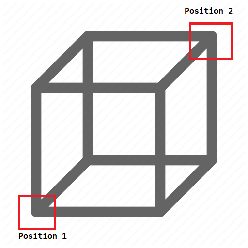

# 故障排除与常见问题解答

## 非OP玩家无法使用标志
将标志移出原版生成保护范围（例如，如果你在server.properties中将生成保护设置为16，则从生成位置移动34个方块）或将生成保护更改为零。非OP玩家在生成保护范围内无法执行某些操作。

## 位置1和位置2
这两个位置用于指定被视为竞技场的区域。（例如WorldEdit中的斧头）

参见[竞技场](arena.md#setting-the-arena-positions)



## 床无法被破坏
BedWars允许你使用任何方块作为目标方块，因此当你将其设置为例如地板时，你不会看到任何错误。所以请检查它，并确保在设置团队目标方块时你正在查看床的头部。

## 添加标志
放置一个标志，并在第一行写上`[BedWars]`或`[BWGame]`（区分大小写），在第二行写上你的竞技场名称。确保你的标志不在原版生成保护范围内。

## 自动为商店物品着色
使用`applycolorbyteam`属性，例如：
```yaml
- price: 1
  price-type: bronze
  properties:
    - name: "applycolorbyteam"
  stack:
    type: white_wool
    amount: 2
```

## 升级
参见[升级](upgrades.md)文章。

## 语言文件
参见[配置](config.md#custom-language)文章。

## PlaceholderAPI占位符
参见[Placeholder API](placeholderapi.md)文章。

## 更改消息前缀
可以在语言文件中全局更改前缀，或使用以下命令为每个竞技场更改前缀：`/bw admin <arena> customprefix &6My Awesome Prefix `。

## 编辑资源
参见[配置](config.md)文章。

## 损坏的商店
确保你的商店是YAML有效的，使用[yamlchecker](https://yamlchecker.com/)，并具有正确的[材料](https://hub.spigotmc.org/javadocs/spigot/org/bukkit/Material.html)和[格式](https://github.com/ScreamingSandals/SimpleInventories/wiki)。

## 指南针传送玩家
你可能安装了WorldEdit或FastAsyncWorldEdit。指南针用于穿墙传送。然而，它仅对有权限或OP的人有效。你可以在WorldEdit配置中禁用此工具或将其绑定到另一个物品。你也可以在BedWars配置中将团队选择物品更改为另一个物品。

## 权限
参见[命令和权限](commands.md#permissions)页面。

## 添加开始和重生物品
你可以通过以下方式添加

### 开始游戏
```yaml
game-start-items: true
gived-game-start-items:
- leather_helmet
- leather_boots
- leather_leggings
- leather_chestplate
- wooden_sword
```

### 重生
```yaml
player-respawn-items: true
gived-player-respawn-items: 
- leather_helmet
- leather_boots
- leather_leggings
- leather_chestplate
- wooden_sword
```

## 村民不生成
以下是一些关于如何排除此错误的信息：

* 确保生物生成已启用
* 你没有使用worldguard保护竞技场
* 确保NPC已启用

## 是否有任何视觉/粒子效果？
是的，有。查看[此页面](config.md#game-effects)

## 更改火球的伤害或爆炸威力
进入你的config.yml，那里有火球的设置。
它位于特殊物品下，不难找到 😛

基本上任何其他特殊物品也是如此。🙂

## 使用Bungeecord设置插件
插件有一个单竞技场Bungeecord模式。查看[此页面](bungee.md)。

## PvP不起作用
确保：

* 在MultiVerse（或类似的多世界插件）中已启用，如果未启用，请执行`/mvm set pvp true <world name>`。
* WorldGuard不允许在竞技场所在的世界中战斗（如果是，请执行`/rg flag <region name> pvp allow`）；
* 你已禁用`spawn-protection`（在server.properties中将其设置为0）。

请记住，BedWars不管理PvP。如果PvP对你不起作用，这是由于配置错误或其他插件引起的。如果上述提示没有帮助，请在我们的Discord服务器上联系我们。

如果你安装了WorldGuard，你也可以使用命令检查哪个插件阻止了PvP。命令是`/wg debug testdamage -t <player_name>`，你需要第二个玩家来测试。点击[这里](https://worldguard.enginehub.org/en/latest/commands/#event-simulation)阅读有关此命令的更多信息。

## 玩家恢复太快/剑造成的伤害非常小
这不是BedWars的问题，请增加服务器的游戏难度（例如从简单到普通）。

## 更改竞技场名称
首先，如果你搞砸了，我们将不提供任何支持，**竞技场文件不应该由人们编辑**。

1. 进入你的BedWars文件夹，然后进入竞技场文件夹。路径应为`plugins/BedWars/arenas`
2. 打开你要更改名称的文件
3. 第一个字段是名称，输入你的新名称。名称不能像这样`test arena`，必须是一个字符串，即`test-arena`。名称也必须是唯一的，即你不能有两个同名的竞技场。
4. 保存文件
5. 重启或重新加载服务器

## 类版本错误
`SomeClass已被较新版本的Java运行时编译（类文件版本55.0），此版本的Java运行时仅识别高达52.0的类文件版本（无法加载类SomeClass）`

这意味着你正在使用Java 8（52.0），但插件至少需要Java 11（55.0），如果你想知道如何更新，请访问[此页面](https://docs.papermc.io/java-install-update)（它告诉你如何更新到Java 17，它可以运行Java 11的软件；类似的方法可用于Java 11）

目前BedWars LATEST_VERSION_HERE不需要Java 11，但最著名的附加组件SBA至少需要Java 11。新版本的BedWars（0.3.0+）将至少需要Java 11。

## 使用挪威语
Yaml规范说字面量`no`表示`false`。要将`no`用作`no`，你需要将其转换为字符串`locale: "no"`

## 玩家在死亡时从BedWars游戏中断开连接或玩家在重新连接后在竞技场中重生
一个插件正在覆盖你服务器上的玩家生成，这些插件可能包括（但不限于）EssentialsSpawn、WorldGuard等。
删除这些插件或在BedWars世界中禁用它们。