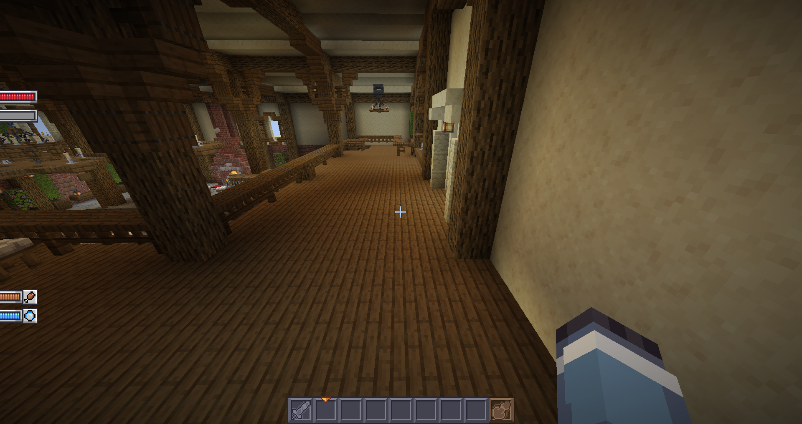

# 小心

```yaml
effects:
  text-effects:
    enabled: false # 请禁用它！！！
    customitem-name-and-lore:
      enabled: false
    chat:
      enabled: false
    sign:
      enabled: false
    book:
      enabled: false
    anvil:
      enabled: false
```
并设置
```yaml
hide-scoreboard-numbers: false
hide-scoreboard-numbers-old-clients: false
```
如果你使用ItemsAdder或Oraxen，请禁用文本效果。  
  
如果你之前使用过HappyHUD，请移除剩余的HappyHUD资源包。它会导致类似的问题。