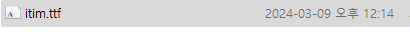

# 显示自定义文本

  
在开始之前，准备好你的ttf文件会很有帮助。将其放入你的**fonts**文件夹中。  

``` yaml
itim:
  file: itim.ttf #可选。定义你的ttf文件位置。
  scale: 16 #渲染比例。该值越大，资源包大小越大。
```
首先，你需要在你的texts文件夹中定义你的文本。

``` yaml
health_bar:
  images:
    1:
      name: empty_bar
    2:
      name: health_bar
      x: 6 #向右6像素
      y: 4 #向下4像素
  texts:
    1:
      name: itim
      pattern: "[health] // [max_health]" #[value] -> 占位符
      number-format: "#,###" #数字格式
      outline: true #是否描边
      layer: 1 #图层编号
      color: green #文本颜色
      scale: 0.5
      x: 10
      align: left

food_bar:
  y: 15 #向下15像素
  images:
    1:
      name: empty_bar
    2:
      name: food_bar
      x: 6 #向右6像素
      y: 4 #向下4像素
  texts:
    1:
      name: itim
      pattern: "[food] // 20"
      number-format: "#,###"
      outline: true
      layer: 1
      color: green
      scale: 0.5
      x: 10
      align: left

mana_bar:
  y: 30 #向下15像素
  images:
    1:
      name: empty_bar
    2:
      name: mana_bar
      x: 6 #向右6像素
      y: 4 #向下4像素
  texts:
    1:
      name: itim
      pattern: "[mmocore_mana] // [mmocore_max_mana]"
      number-format: "#,###"
      outline: true
      layer: 1
      color: green
      scale: 0.5
      x: 10
      align: left

stamina_bar:
  y: 45 #向下15像素
  images:
    1:
      name: empty_bar
    2:
      name: stamina_bar
      x: 6 #向右6像素
      y: 4 #向下4像素
  texts:
    1:
      name: itim
      pattern: "[mmocore_stamina] // [mmocore_max_stamina]"
      number-format: "#,###"
      outline: true
      layer: 1
      color: green
      scale: 0.5
      x: 10
      align: left
```
其次，按照以下步骤在你的布局中合并文本。  
  
成功！

