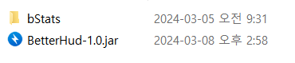
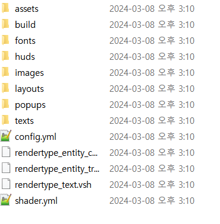

# 安装

1. 首先，你需要从 [spigot 页面](https://www.spigotmc.org/resources/%E2%AD%90betterhud%E2%AD%90a-beautiful-hud-plugin-you-havent-seen-before%E2%9C%85auto-resource-pack-build%E2%9C%85.115559/) 下载，并将 .jar 文件放入 `plugins/` 文件夹中。多么简单！  
   

2. 其次，启动你的服务器，配置文件将自动生成。  
   

3. 你应该**将 build 文件夹合并到你的资源包中**。  
   如果你安装了 ItemsAdder，你可以通过在 ItemsAdder 的配置中写入以下内容来轻松合并。
``` yaml  
# ItemsAdder config.yml  
merge_other_plugins_resourcepacks_folders:  
  - "BetterHud/build"  

effects:  
  hide-scoreboard-numbers: false  
  hide-scoreboard-numbers-old-clients: false  
  text-effects:  
    enabled: false  

custom-font:  
  enabled: false  

pre_1_21_2_shaders_fix:  
  enabled: false  
```  

如果你安装了 Nexo，你可以通过更改 **BetterHud** 配置中的这些设置来轻松合并。
``` yaml  
# BetterHud config.yml  
pack-type: none  
```  

4. 你应该已经准备好让插件正常工作了。

