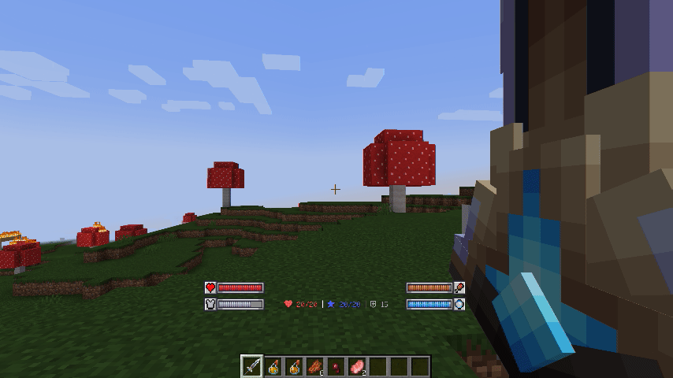
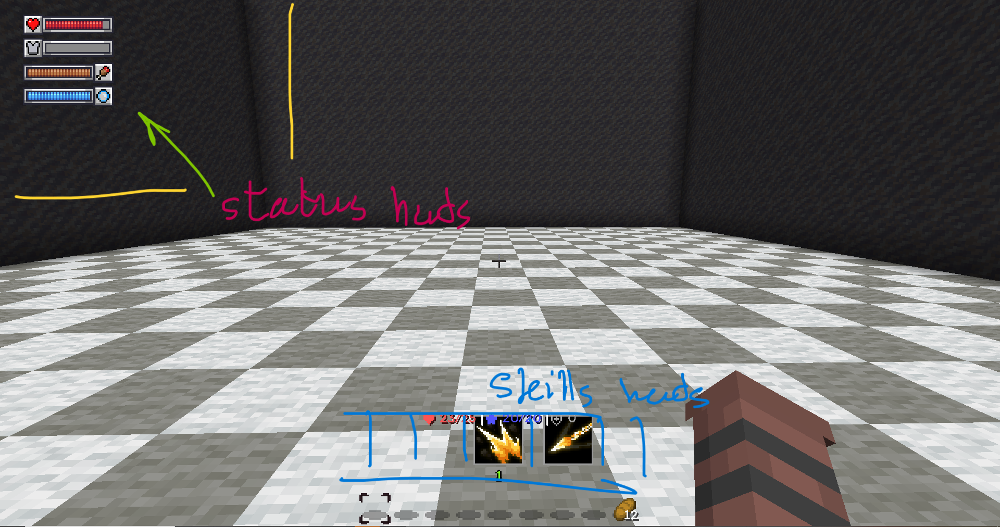
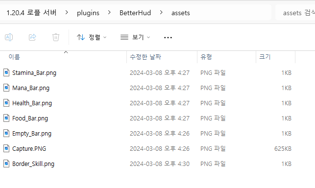

# 制作你自己的 HUD

  
如果你第一次安装这个插件，正如你所看到的，这个HUD会自动生成。  

  
我将展示这个HUD，向你展示这个插件的功能。感谢dreamcatcher！

  
首先，你需要放置你想要使用的图片。

``` yaml
empty_bar: #图片名称。
  type: single #图片类型。
  file: Empty_Bar.png #文件位置。

health_bar:
  type: listener #监听器类型
  file: Health_Bar.png
  split: 25
  split-type: left
  setting:
    listener:
      class: health
food_bar:
  type: listener
  file: Food_Bar.png
  split: 25
  split-type: left
  setting:
    listener:
      class: food
mana_bar:
  type: listener
  file: Mana_Bar.png
  split: 25
  split-type: left
  setting:
    listener:
      class: mmocore_mana
stamina_bar:
  type: listener
  file: Stamina_Bar.png
  split: 25
  split-type: left
  setting:
    listener:
      class: mmocore_stamina
```
其次，在images文件夹中定义你的**图片**。

``` yaml
health_bar:
  images:
    1:
      name: empty_bar
    2:
      name: health_bar
      x: 6 #向右6像素
      y: 4 #向下4像素

food_bar:
  y: 15 #向下15像素
  images:
    1:
      name: empty_bar
    2:
      name: food_bar
      x: 6 #向右6像素
      y: 4 #向下4像素

mana_bar:
  y: 30 #向下15像素
  images:
    1:
      name: empty_bar
    2:
      name: mana_bar
      x: 6 #向右6像素
      y: 4 #向下4像素

stamina_bar:
  y: 45 #向下15像素
  images:
    1:
      name: empty_bar
    2:
      name: stamina_bar
      x: 6 #向右6像素
      y: 4 #向下4像素
```
第三，创建一个**图片布局**来分组你的图片。
``` yaml
default_hud:
  conditions:
    1:
      first: dead #玩家是否死亡
      second: false
      operation: "=="
    2:
      first: gamemode #玩家的游戏模式
      second: "'CREATIVE'" #'<string' = 字符串格式
      operation: "!="
  layouts:
    1:
      name: health_bar
      x: 15 #向右15%到GUI
      y: 20 #向下20%到GUI
    2:
      name: food_bar
      x: 15 #向右15%到GUI
      y: 20 #向下20%到GUI
    3:
      name: mana_bar
      x: 15 #向右15%到GUI
      y: 20 #向下20%到GUI
    4:
      name: stamina_bar
      x: 15 #向右15%到GUI
      y: 20 #向下20%到GUI
```
第四，定义一个**HUD**来分组你的图片布局。
``` yaml
info: "<gold><b>[!]</gold> "
warn: "<red><b>[!]</red> "

number-format: "#,###.#"

default-hud:
  - default_hud

default-popup: []
```
最后，将你的HUD定义为默认HUD，在default-hud中写入你的HUD名称。  
  
成功！
