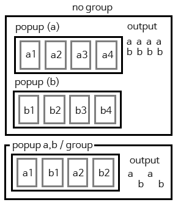
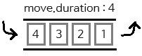
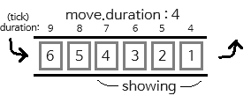
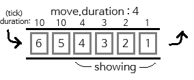
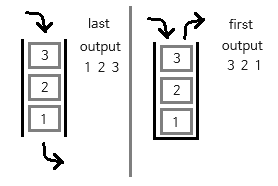

# 弹出窗口

弹出窗口具有极高的可扩展性。

可以说，几乎所有你能想到的深层功能都来自弹出窗口。

例如，增益图标、技能HUD等。

```
monster_health:
  triggers:
    1:
      class: entity_attack
  group: mob_group
  unique: true # 默认: false
  queue: true # 默认: false
  #push: true
  always-check-condition: false # 默认: true
  sort: first # 类型: last/first , 默认: last
  duration: 60 #tick
  key-mapping: true #默认: false
  x: 10
  y: 35
  move:
    duration: 3
    pixel:
      x-equation: 0
      y-equation: 20t
  layouts:
    1:
      name: monster_health
```

有几种方式可以运行弹出窗口。
1. 将其作为命令运行
2. 在config.yml中将其注册为默认弹出窗口，以便在满足条件时显示弹出窗口。（在这种情况下，不应设置持续时间。）
3. 可以使用触发器

## 触发器
```
monster_health:
  triggers:
    1:
      class: entity_attack
```
触发器是一种功能，当特定动作被触发时，会触发弹出窗口。

触发器列表如下，并提供其自己的PAPI。

***

entity_attack : 当玩家攻击实体时。

entity_damage : 当玩家被实体伤害时。

entity_kill : 当玩家杀死实体时

entity_dead : 当玩家死亡时

### papi
仅限触发器的papi

```
(监听器)
entity_health

(返回字符串)
entity_name
entity_custom_name
entity_type

(返回数字)
entity_max_health
entity_health

entity_last_health
entity_last_health_percentage

entity_health_percentage
entity_vehicle_health_percentage

mythicmobs_aura_duration_reversed:arg
mythicmobs_entity_current_cooldown:arg
mythicmobs_entity_aura_stack:arg
mythicmobs_entity_aura_max_duration:arg
mythicmobs_entity_aura_duration:arg
mythicmobs_entity_aura_duration_reversed:arg

(返回布尔值)
entity_dead
has_off_hand
has_main_hand

mythicmobs_entity_has_aura:arg

```

## 组
将多个弹出窗口创建为一个组。

默认: `none`

例如: `group: skill`



## unique
避免重复弹出窗口。

默认值：`false`

## queue
是否保存队列外的弹出窗口

默认值：`false`

默认情况下，当设置为`move.duration: 4`时，弹出窗口最多只能显示四个，

由于空间不足，任何进一步的弹出窗口请求将被忽略。



当你使用`queue: true`时，它的工作方式如下

例如，在1 tick的增量中总共发送6个弹出窗口后，1 tick后，我们看到以下结构



仍然最多看到四个弹出窗口，但在第一个弹出窗口结束后，将开始看到第五个弹出窗口。

等待的弹出窗口的持续时间也会减少。为了防止这种情况，使用以下选项

### always-check-condition

队列外的弹出窗口是否也应该有动画tick。

默认值：`true`

`always-check-condition: false`，等待的弹出窗口不会减少持续时间。



## push

当弹出窗口请求达到最大值时，立即推送最旧的弹出窗口

默认值：`false`

## sort

如何排列弹出窗口的选项。

默认值：`last`

`sort: first`以堆栈方式执行，

`sort: last`以队列方式执行。



## duration
确定弹出窗口的持续时间。

单位为tick，如果未输入，将持续无限期。

默认值：`0`（无限）

## key-mapping
将弹出窗口与特定键映射为唯一键。

例如，需要显示实体或其他玩家的健康条。

默认值：`false`

## x,y coord
与HUD相同的方式，您定义将玩家屏幕划分为百分比的位置。

## move
设置显示多个弹出窗口时放置弹出窗口的规则。

```
  move:
    duration: 3
    pixel:
      x-equation: 0
      y-equation: 20t
```


### 持续时间
您希望在屏幕上显示的最大弹出窗口数量。

### 像素
定义它应该如何像布局一样逐像素移动。

它与[操作文档](operations.md)有非常密切的关系。

例如，如果您只想向右偏移20像素，可以执行类似`x-equation: 20t`的操作。


要像这张照片一样操作
```
buff_absorption:
  group: buff
  unique: true
  layouts:
    1:
      name: buff_absorption
      x: 90
      y: 10
  conditions:
    1:
      first: potion_effect_duration:absorption
      second: 0
      operation: ">"
  move:
    duration: 33
    pixel:
      x-equation: -floor((t - 1) / 8) * 40
      y-equation: (((t - 1) % 8) + 1) * 40
 ```
以这种方式，需要一些数学知识。

