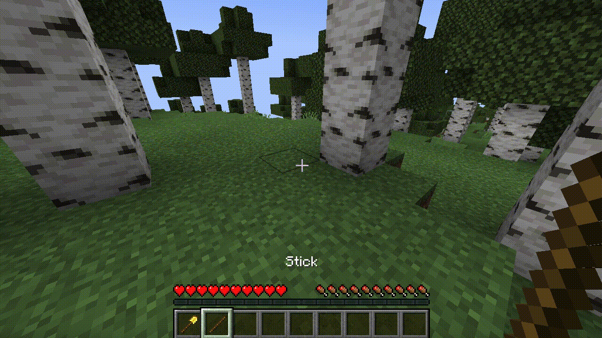

# 信任

HuskClaims 允许您为用户、用户组和标签在 [[Claims]] 中设置“信任等级”。信任等级授予用户操作类型标志和权限，这些权限赋予用户相应的领地访问权和管理权限。信任等级完全可配置，可以通过编辑 `trust_levels.yml` 配置文件进行自定义或完全更改。

## 信任等级
信任等级在 `trust_levels.yml` 配置文件中定义，默认的信任等级基于经典的 GriefPrevention 插件设置，详细信息如下。每个信任等级都有一个相关的命令（例如，build trust）。用户、用户组或标签一次只能处于一个信任等级中，并且信任等级是明确定义的；它们不会从较低等级继承授予的操作类型或权限。

<table>
    <thead>
        <tr>
            <th>信任等级</th>
            <th>命令</th>
            <th>描述</th>
            <th>允许的操作</th>
            <th>允许的权限</th>
        </tr>
    </thead>
    <tbody>
        <tr>
            <td>管理</td>
            <td><code>/permissiontrust</code></td>
            <td>授予完全的领地管理权限，允许玩家信任/不信任其他用户，切换操作组，并创建子领地（以及以下所有权限）。</td>
            <td>
                <details>
                <summary>查看列表</summary>
                <ul>
                    <li style={{opacity:66}}>BLOCK_INTERACT</li>
                    <li style={{opacity:66}}>ENTITY_INTERACT</li>
                    <li style={{opacity:66}}>REDSTONE_INTERACT</li>
                    <li style={{opacity:66}}>BREAK_VEHICLE</li>
                    <li style={{opacity:66}}>PLACE_VEHICLE</li>
                    <li style={{opacity:66}}>ENDER_PEARL_TELEPORT</li>
                    <li style={{opacity:66}}>START_RAID</li>
                    <li style={{opacity:66}}>CONTAINER_OPEN</li>
                    <li style={{opacity:66}}>BLOCK_BREAK</li>
                    <li style={{opacity:66}}>BLOCK_PLACE</li>
                    <li style={{opacity:66}}>FARM_BLOCK_BREAK</li>
                    <li style={{opacity:66}}>FARM_BLOCK_PLACE</li>
                    <li style={{opacity:66}}>FARM_BLOCK_INTERACT</li>
                    <li style={{opacity:66}}>PLACE_HANGING_ENTITY</li>
                    <li style={{opacity:66}}>BREAK_HANGING_ENTITY</li>
                    <li style={{opacity:66}}>PLAYER_DAMAGE_PLAYER</li>
                    <li style={{opacity:66}}>PLAYER_DAMAGE_PERSISTENT_ENTITY</li>
                    <li style={{opacity:66}}>PLAYER_DAMAGE_MONSTER</li>
                    <li style={{opacity:66}}>PLAYER_DAMAGE_ENTITY</li>
                    <li style={{opacity:66}}>FILL_BUCKET</li>
                    <li style={{opacity:66}}>EMPTY_BUCKET</li>
                    <li style={{opacity:66}}>USE_SPAWN_EGG</li>
                </ul>
                </details>
            </td>
            <td>
                <details>
                <summary>查看列表</summary>
                <ul>
                    <li>MANAGE_TRUSTEES</li>
                    <li>MANAGE_CHILD_CLAIMS</li>
                    <li>MANAGE_OPERATION_GROUPS</li>
                    <li>MANAGE_BANS</li>
                    <li>MAKE_PRIVATE</li>
                </ul>
                </details>
            </td>
        </tr>
        <tr>
            <td>建造</td>
            <td><code>/trust</code></td>
            <td>授予用户在领地内破坏和放置所有方块的权限（以及以下所有权限）。</td>
            <td>
                <details>
                <summary>查看列表</summary>
                <ul>
                    <li style={{opacity:66}}>BLOCK_INTERACT</li>
                    <li style={{opacity:66}}>ENTITY_INTERACT</li>
                    <li style={{opacity:66}}>REDSTONE_INTERACT</li>
                    <li style={{opacity:66}}>BREAK_VEHICLE</li>
                    <li style={{opacity:66}}>PLACE_VEHICLE</li>
                    <li style={{opacity:66}}>ENDER_PEARL_TELEPORT</li>
                    <li style={{opacity:66}}>START_RAID</li>
                    <li style={{opacity:66}}>CONTAINER_OPEN</li>
                    <li>BLOCK_BREAK</li>
                    <li>BLOCK_PLACE</li>
                    <li>FARM_BLOCK_BREAK</li>
                    <li>FARM_BLOCK_PLACE</li>
                    <li>FARM_BLOCK_INTERACT</li>
                    <li>PLACE_HANGING_ENTITY</li>
                    <li>BREAK_HANGING_ENTITY</li>
                    <li>PLAYER_DAMAGE_PLAYER</li>
                    <li>PLAYER_DAMAGE_PERSISTENT_ENTITY</li>
                    <li>PLAYER_DAMAGE_MONSTER</li>
                    <li>PLAYER_DAMAGE_ENTITY</li>
                    <li>FILL_BUCKET</li>
                    <li>EMPTY_BUCKET</li>
                    <li>USE_SPAWN_EGG</li>
                </ul>
                </details>
            </td>
            <td style={{textAlign:'center'}}>
                (无)
            </td>
        </tr>
        <tr>
            <td>容器</td>
            <td><code>/containertrust</code></td>
            <td>授予用户打开容器（如箱子、漏斗、熔炉等）并编辑其中物品的权限（包括以下所有权限）。</td>
            <td>
                <details>
                <summary>查看列表</summary>
                <ul>
                    <li style={{opacity:66}}>BLOCK_INTERACT</li>
                    <li style={{opacity:66}}>ENTITY_INTERACT</li>
                    <li style={{opacity:66}}>REDSTONE_INTERACT</li>
                    <li style={{opacity:66}}>BREAK_VEHICLE</li>
                    <li style={{opacity:66}}>PLACE_VEHICLE</li>
                    <li style={{opacity:66}}>ENDER_PEARL_TELEPORT</li>
                    <li style={{opacity:66}}>START_RAID</li>
                    <li>CONTAINER_OPEN</li>
                </ul>
                </details>
            </td>
            <td style={{textAlign:'center'}}>
                (无)
            </td>
        </tr>
        <tr>
            <td>访问</td>
            <td><code>/accesstrust</code></td>
            <td>授予用户按下按钮、拉杆和压力板，以及打开门、活板门和栅栏门的权限。</td>
            <td>
                <details>
                <summary>查看列表</summary>
                <ul>
                    <li>BLOCK_INTERACT</li>
                    <li>ENTITY_INTERACT</li>
                    <li>REDSTONE_INTERACT</li>
                    <li>BREAK_VEHICLE</li>
                    <li>PLACE_VEHICLE</li>
                    <li>ENDER_PEARL_TELEPORT</li>
                    <li>START_RAID</li>
                </ul>
                </details>
            </td>
            <td style={{textAlign:'center'}}>
                (无)
            </td>
        </tr>
    </tbody>
</table>

领地所有者或拥有`MANAGE_TRUSTEES`权限的用户可以通过这些命令管理信任级别低于他们的用户的信任。要信任一个用户，站在领地内并使用相关的信任命令，后跟`user`/`@group`/`#tag`；要撤销信任，执行相同的操作但使用`/untrust`。你可以通过在命令末尾添加更多的`users`/`@groups`/`#tags`来同时信任/撤销多个实体的信任。最后，要查看受信任用户的列表，请使用`/trustlist`。



### 配置信任级别
> **警告：** 在配置文件中删除或更改现有信任级别的ID是一个破坏性操作！玩家将失去他们的信任级别，需要由领地所有者重新信任。

信任级别可以在`trust_levels.yml`配置文件中进行配置。信任级别按其`weight`值排序；拥有`MANAGE_TRUSTEES`权限的用户无法更改用户/组/标签的信任级别，如果他们的等级或将成为比当前信任级别更高的权重。

默认的信任级别定义如下：

<details>
<summary>Trust levels config (trust_levels.yml)</summary>

```yaml
# ┏━━━━━━━━━━━━━━━━━━━━━━━━━━━━━━┓
# ┃   HuskClaims - Trust Levels  ┃
# ┃    Developed by William278   ┃
# ┣━━━━━━━━━━━━━━━━━━━━━━━━━━━━━━┛
# ┣╸ List of trust levels users & groups can be assigned to in claims
# ┣╸ Config Help: https://william278.net/docs/huskclaims/trust/
# ┗╸ Documentation: https://william278.net/docs/huskclaims/

trust_levels:
  - id: manage
    display_name: Manage
    description: Allows users to manage trustees & make child claims
    color: '#fc4e03'
    command_aliases:
      - permissiontrust
      - managetrust
    flags:
      - BLOCK_INTERACT
      - ENTITY_INTERACT
      - REDSTONE_INTERACT
      - PLACE_VEHICLE
      - BREAK_VEHICLE
      - ENDER_PEARL_TELEPORT
      - START_RAID
      - CONTAINER_OPEN
      - BLOCK_BREAK
      - BLOCK_PLACE
      - FARM_BLOCK_BREAK
      - FARM_BLOCK_PLACE
      - FARM_BLOCK_INTERACT
      - PLACE_HANGING_ENTITY
      - BREAK_HANGING_ENTITY
      - PLAYER_DAMAGE_PLAYER
      - PLAYER_DAMAGE_PERSISTENT_ENTITY
      - PLAYER_DAMAGE_MONSTER
      - PLAYER_DAMAGE_ENTITY
      - FILL_BUCKET
      - EMPTY_BUCKET
      - USE_SPAWN_EGG
    privileges:
      - MANAGE_TRUSTEES
      - MANAGE_CHILD_CLAIMS
      - MANAGE_OPERATION_GROUPS
      - MANAGE_BANS
      - MAKE_PRIVATE
    weight: 400
  - id: build
    display_name: Build
    description: Allows users to build in the claim
    color: '#fcd303'
    command_aliases:
      - trust
      - buildtrust
    flags:
      - BLOCK_INTERACT
      - ENTITY_INTERACT
      - REDSTONE_INTERACT
      - PLACE_VEHICLE
      - BREAK_VEHICLE
      - ENDER_PEARL_TELEPORT
      - START_RAID
      - CONTAINER_OPEN
      - BLOCK_BREAK
      - BLOCK_PLACE
      - FARM_BLOCK_BREAK
      - FARM_BLOCK_PLACE
      - FARM_BLOCK_INTERACT
      - PLACE_HANGING_ENTITY
      - BREAK_HANGING_ENTITY
      - PLAYER_DAMAGE_PLAYER
      - PLAYER_DAMAGE_PERSISTENT_ENTITY
      - PLAYER_DAMAGE_MONSTER
      - PLAYER_DAMAGE_ENTITY
      - FILL_BUCKET
      - EMPTY_BUCKET
      - USE_SPAWN_EGG
    privileges: []
    weight: 300
  - id: container
    display_name: Container
    description: Allows users to open chests & other containers
    color: '#5efc03'
    command_aliases:
      - containertrust
    flags:
      - BLOCK_INTERACT
      - ENTITY_INTERACT
      - REDSTONE_INTERACT
      - PLACE_VEHICLE
      - BREAK_VEHICLE
      - ENDER_PEARL_TELEPORT
      - START_RAID
      - CONTAINER_OPEN
    privileges: []
    weight: 200
  - id: access
    display_name: Access
    description: Allows users to use doors, buttons, levers, etc.
    color: '#36e4ff'
    command_aliases:
      - accesstrust
    flags:
      - BLOCK_INTERACT
      - ENTITY_INTERACT
      - REDSTONE_INTERACT
      - PLACE_VEHICLE
      - BREAK_VEHICLE
      - ENDER_PEARL_TELEPORT
      - START_RAID
    privileges: []
    weight: 100
# The operation types that the claim owner can perform in their own claim
allowed_owner_operations:
  - FARM_BLOCK_PLACE
  - USE_SPAWN_EGG
  - ENTITY_INTERACT
  - PLACE_HANGING_ENTITY
  - PLAYER_DAMAGE_PERSISTENT_ENTITY
  - FARM_BLOCK_INTERACT
  - PLAYER_DAMAGE_MONSTER
  - BREAK_VEHICLE
  - REDSTONE_INTERACT
  - BLOCK_BREAK
  - BLOCK_PLACE
  - PLAYER_DAMAGE_PLAYER
  - FARM_BLOCK_BREAK
  - START_RAID
  - ENDER_PEARL_TELEPORT
  - PLAYER_DAMAGE_ENTITY
  - FILL_BUCKET
  - BLOCK_INTERACT
  - CONTAINER_OPEN
  - BREAK_HANGING_ENTITY
  - EMPTY_BUCKET
  - PLACE_VEHICLE
```
</details>

## 用户、用户组与标签
用户、用户组和标签可以在信任级别上被信任。

### 用户
要在声明中信任一个用户，请站在声明中并输入信任级别命令，后跟他们的用户名。

### 用户组
用户组是一种同时管理多个用户组信任的方式，对于大型项目非常方便。用户组属于声明所有者；请注意，因此您不能在管理员声明中信任组。以下是一个声明所有者在其声明中管理用户组的示例：

| 命令                                    | 结果                                                                                                   |
|--------------------------------------------|----------------------------------------------------------------------------------------------------------|
| `/usergroup awesome_people add Steve Alex` | 创建一个名为`awesome_people`的用户组，并添加玩家`Steve`和`Alex`。                     |
| `/trust @awesome_people`                   | 在您所在的声明中信任组`awesome_people`（有效地给予`Steve`和`Alex`访问权限） |
| `/usergroup awesome_people add William278` | 将`William278`添加到组`awesome_people`中，也给予`William278`访问权限。            |
| `/usergroup awesome_people add Steve`      | 从组`awesome_people`中移除`Steve`，有效地撤销他们对声明的访问权限。         |
| `/usergroup awesome_people delete`         | 删除组`awesome_people`。`Alex`和`William278`将失去对声明的访问权限。               |

请注意，删除用户组不会将其从声明中移除；它将保持信任状态但会变灰。如果声明所有者重新创建具有新成员的组，该组将重新启用。

### 信任标签
信任标签是一种抽象的方式来表示一组用户，可以通过其他插件通过[[API]]或通过特殊的内置钩子提供。以下是内置标签的列表。

| 标签            | 描述                                                                                                                           |
|----------------|---------------------------------------------------------------------------------------------------------------------------------------|
| `#public`      | 授予对声明的公共访问权限。                                                                                                       |
| `#role/(name)` | 授予对声明中[LuckPerms](https://luckperms.net/)权限组的访问权限。需要安装LuckPerms并启用钩子。 |

请注意，信任标签的使用可能受到[[权限]]的限制；默认情况下，用户不能信任LuckPerms角色。

### 可信任计算顺序
如果用户属于多个可信任方，则按照以下顺序计算用户的有效信任级别，他们将获得为他们定义的最明确的信任级别：

1. 用户 &mdash; 如果用户在声明中具有明确的权限，则他们以该级别被信任。
2. 用户组 &mdash; 如果用户是声明所有者的组之一，则他们以该级别被信任。
3. 信任标签 &mdash; 如果用户符合信任标签的标准，则他们以该级别被信任。

**示例：** 声明所有者已信任标签`#public`为“管理”信任级别，授予所有人管理访问权限。所有者还明确信任用户`Steve`为“构建”信任级别。由于“Steve”作为用户被信任（比信任标签更优先的可信任类型），他们的有效信任级别是“构建信任”，而不是“管理信任”。

### 所有者允许的权限
所有者在其声明中拥有所有权限，无论其信任级别如何。
您可以通过编辑`trust_levels.yml`文件中的`allowed_owner_operations`部分来移除所有者的某些权限。
例如，这可能有助于移除所有者在声明中进行PVP的能力。