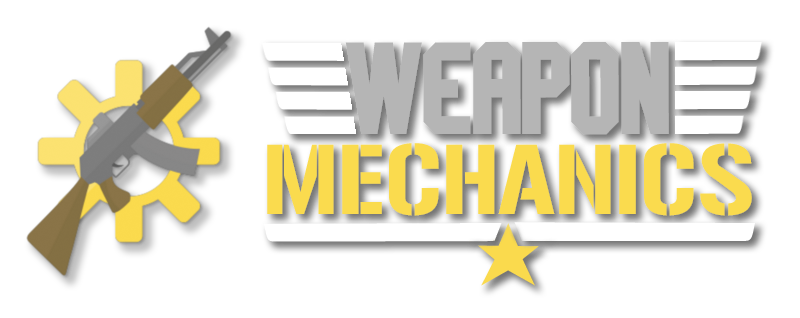

# 主页

WeaponMechanics是Minecraft中的新一代武器。这是有史以来最先进、高效和可定制的枪械插件。我们在每个方面都进行了最大化的优化，因为我们知道每个服务器都希望拥有独特的枪械体验。

## 链接

* [下载](https://github.com/WeaponMechanics/MechanicsMain/releases)
* [Spigot页面](https://www.spigotmc.org/resources/weaponmechanics-guns-in-minecraft-1-12-2-1-20-1.99913/)
* [源代码](https://github.com/WeaponMechanics/MechanicsMain)
* [功能请求和错误报告](https://github.com/WeaponMechanics/MechanicsMain/issues/new/choose)
* [社区支持](https://discord.gg/ERVgpfg)（使用 `#weaponmechanics-support`）

## 创建/修改配置文件

我建议在修改.yml文件（以及其他基于文本的文件，如.json）时使用[VSCode](https://code.visualstudio.com/download)。

在创建新武器时，复制并粘贴现有武器，然后更改/添加配置选项。例如，如果你希望枪械造成更多伤害，你可以查看[damage](weapon-modules/damage/ "mention")模块。现在你可以使用该维基页面自由调整数字。

查看[weapon-modules](weapon-modules/ "mention")以获取有关创建武器的更多信息。

## 支持

WeaponMechanics及其附加组件以及我们的其他插件都离不开一些财务支持。即使你无法在经济上支持我，请考虑留下5星评价。这会吸引新的人购买我的插件，为你提供更多功能。双赢！

* [GitHub赞助商](https://github.com/sponsors/CJCrafter)
* [PayPal捐赠](https://www.paypal.com/paypalme/cjcrafter)
* [购买WeaponMechanicsCosmetics](https://www.spigotmc.org/resources/weaponmechanicscosmetics-guns-in-minecraft-1-12-2-1-20-1.104539/)
* 购买WeaponMechanicsPlus