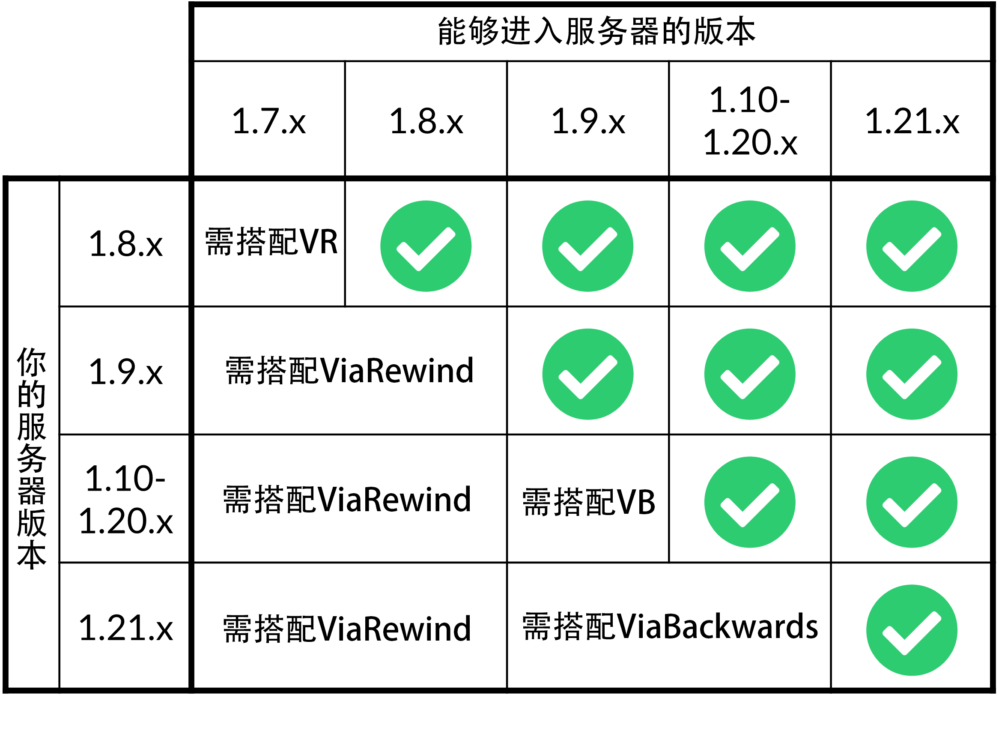

# 介绍

此插件是 **ViaVersion** 的拓展，用于让服务器支持更早版本(最多到 1.9)的客户端进入

**以下是跨版本的支持情况:**

## 对于插件服

在安装此插件之前，你需要安装 **ViaVersion** 作为前置

同时，与 ViaVersion 类似，如果你使用 **Velocity / BungeeCord** ，仅在所有或有跨版本需求的子服务器中安装即可。

不要在代理端安装，否则会带来不幸

## 对于 Mod 服

ViaBackwards 不仅是插件，而且还是 Mod ，需要搭配 ViaFabric 或者 ViaFabricPlus 使用

关于其在 Mod 服上的安装会在安装中讲到