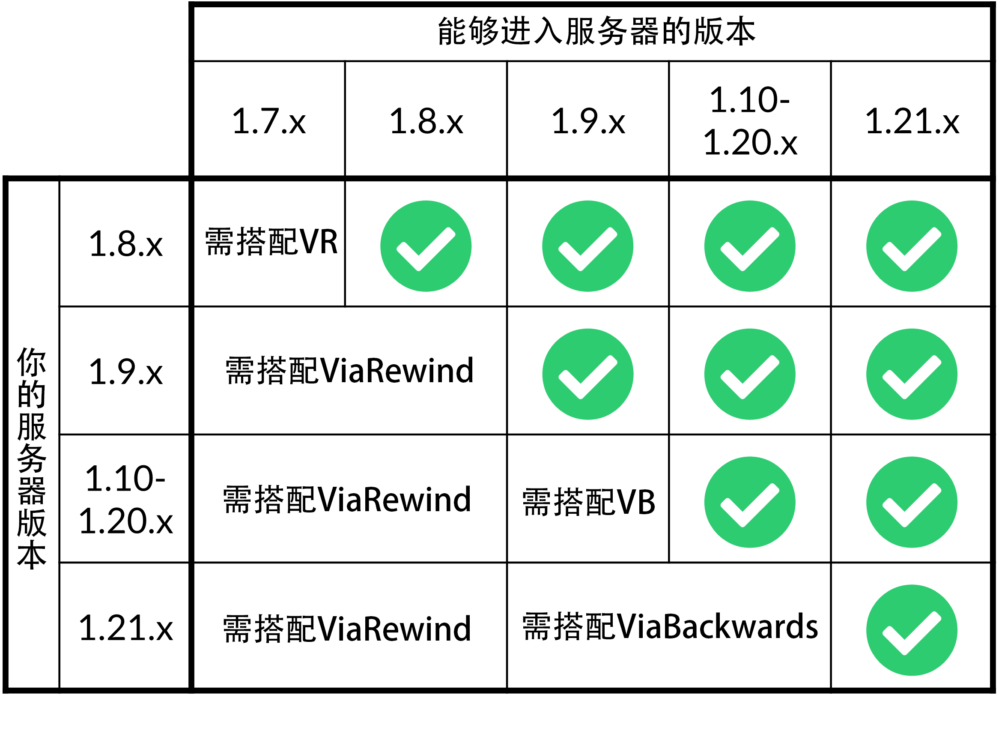

# ViaVersion

你是否因为服务器只能让与服务器版本相同的玩家进入而感到困惑？这也太不人性化了！

别担心，**ViaVersion** 跨版本插件可以解决这个问题！

只需要将这个插件放进你的 plugins 文件夹中，并重启服务器，即可让更新版本的玩家进入你的服务器游玩啦。

当然，ViaVersion 不仅仅是一个单端插件，它还支持 Velocity / BungeeCord 这类代理端，也可用于 Forge / Fabric 等 Mod 服务器中(ViaForge / ViaFabric)。

我们建议，在安装此插件前，先通读我们的文档！

**以下是跨版本的支持情况:**

*注：ViaVersion 本身只能向前支持，需要向后支持可以使用 ViaBackwards 和 ViaRewind。*

如果你使用 **Velocity / BungeeCord** ，仅在所有或有跨版本需求的子服务器中安装即可。

代理端当然也可以安装，但是最好不要这么干，这可能会导致严重问题。