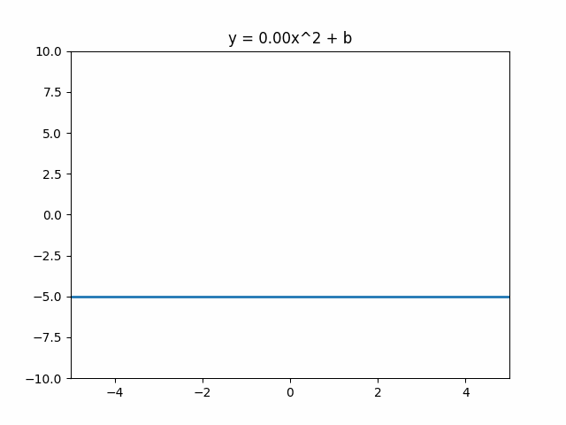

# 爆炸

WeaponMechanics拥有自定义的爆炸系统（与大多数插件不使用TNT相同的代码）。这使我们能够控制爆炸的各个方面，例如形状和伤害。

如果您正在使用WorldGuard，您可以在区域中禁用爆炸。请查看[#worldguard](../../addons.md#worldguard "mention")以获取更多信息。

```yaml
  Explosion:
    Knockback_Multiplier: <Double>
    Explosion_Exposure: <Default/Distance/None>
    Explosion_Shape: <Sphere/Cube/Parabola/Default>
    Explosion_Type_Data:
      Yield: <Double>
      Radius: <Double>
      Angle: <Double>
      Depth: <Double>
      Width: <Double>
      Height: <Double>
      Rays: <Integer>
    Detonation:
      Delay_After_Impact: <Ticks>
      Remove_Projectile_On_Detonation: <true/false>
      Impact_When:
        Spawn: <true/false>
        Entity: <true/false>
        Block: <true/false>
    Cluster_Bomb:
      Split_Projectile: <ProjectileSerializer>
      Projectile_Speed: <Double>
      Number_Of_Bombs: <Integer>
      Number_Of_Splits: <Integer>
      Detonation:
        Delay_After_Impact: <Ticks>
        Remove_Projectile_On_Detonation: <true/false>
        Impact_When:
          Spawn: <true/false>
          Entity: <true/false>
          Block: <true/false>
      Mechanics: <Mechanics>
    Airstrike:
      Dropped_Projectile: <ProjectileSerializer>
      Minimum_Bombs: <Integer>
      Maximum_Bombs: <Integer>
      Height: <Double>
      Vertical_Randomness: <Double>
      Distance_Between_Bombs: <Double>
      Maximum_Distance_From_Center: <Double>
      Layers: <Integer>
      Delay_Between_Layers: <Integer>
      Detonation:
        Delay_After_Impact: <Ticks>
        Remove_Projectile_On_Detonation: <true/false>
        Impact_When:
          Spawn: <true/false>
          Entity: <true/false>
          Block: <true/false>
      Mechanics: <Mechanics>
    Block_Damage:
      Spawn_Falling_Block_Chance: 50%
      Drop_Broken_Block_Chance: 50%
      Damage_Per_Hit: <Integer>
      Default_Block_Durability: <Integer>
      Default_Mode: <CANCEL/BREAK/CRACK>
      Default_Mask: <Material>
      Blocks:
        - <Material*> <CANCEL/BREAK/CRACK*> <ShotsToBreakBlock> <Mask>
    Regeneration:
      Ticks_Before_Start: <Integer>
      Max_Blocks_Per_Update: <Integer>
      Ticks_Between_Updates: <Integer>
    Flashbang:
      Effect_Distance: <Double>
      Mechanics: <Mechanics>
    Mechanics: <Mechanics>
```

#### Knockback_Multiplier

控制爆炸对实体的击退效果。默认值为`1.0`。设置为`0.0`可禁用击退效果。使用大于1的数字将使玩家被击退得更快、更远。

#### Explosion_Exposure

实体的曝光程度决定了它们受到的伤害大小。曝光程度的计算涉及射线追踪，计算起来较为复杂。为了减少潜在的延迟，您可能希望更改此设置。

import Tabs from '@theme/Tabs';
import TabItem from '@theme/TabItem';

<Tabs queryString="exposure">
<TabItem value="DEFAULT" label="DEFAULT">

`Explosion_Exposure: DEFAULT`

该方法与原版类似，但使用的CPU资源更多。适用于具有较长重新加载时间或不经常使用的武器。

</TabItem>

<TabItem value="OPTIMIZED" label="OPTIMIZED">

`Explosion_Exposure: OPTIMIZED`

与DEFAULT方法类似，但射线追踪较少。适用于任何服务器。

</TabItem>

<TabItem value="DISTANCE" label="DISTANCE">

`Explosion_Exposure: DISTANCE`

通过计算实体与爆炸中心之间的距离来确定曝光程度。由于此方法不使用射线追踪，因此非常快速。适用于发射速度很快且爆炸较小的武器。

由于此方法不使用射线追踪，爆炸可以穿墙伤害实体。

</TabItem>

<TabItem value="NONE" label="NONE">

`Explosion_Exposure: NONE`

最快的方法，将100%的曝光程度应用于爆炸形状内的所有实体。几乎不应使用此方法，因为它会在墙壁上对实体造成全额伤害，无论它们离爆炸中心有多远。

仅适用于小型爆炸。

</TabItem>
</Tabs>

#### Explosion_Shape

被炸毁的方块的形状。每个形状在`Explosion_Type_Data`中都有自己的“参数”。请查看每个形状的简单示例。

<Tabs queryString="shape">
<TabItem value="DEFAULT" label="默认">

复制了[普通爆炸](https://minecraft.fandom.com/wiki/Explosion)。参数：

* `Yield` -> 爆炸中心破坏方块的最大距离。
  * 作为参考，`tnt=4`，`creeper=3`，`charged creeper=6`。
* `Rays` -> 每个方向的射线投射数量。默认为16。
  * 增加射线数量可能看起来更好，但会消耗更多的CPU。

以下示例创建了一个具有增加细节的大型爆炸。

```yaml
  Explosion:
    # 其他参数...
    Explosion_Shape: DEFAULT
    Explosion_Type_Data:
      Yield: 15.0
      Rays: 32
```

:::danger
`DEFAULT`爆炸形状**无法**破坏普通爆炸可以破坏的方块，例如黑曜石和基岩。如果您想破坏这些方块，请使用其他形状，例如`SPHERE`。
:::

</TabItem>
<TabItem value="SPHERE" label="球体">

一个球形的爆炸。参数：

* `Radius` -> 方块被破坏的半径。

以下示例创建了一个半径为3个方块的球形洞。

```yaml
  Explosion:
    # 其他参数...
    Explosion_Shape: SPHERE
    Explosion_Type_Data:
      Radius: 3.0
```

</TabItem>
<TabItem value="CUBE" label="立方体">

一个形状为大矩形的爆炸。参数：

* `Width` -> 矩形的宽度，以方块为单位。
* `Height` -> 矩形的高度，以方块为单位。

以下示例创建了一个5x5的立方体爆炸。

```yaml
  Explosion:
    # 其他参数...
    Explosion_Shape: CUBE
    Explosion_Type_Data:
      Width: 5.0
      Height: 5.0
```

</TabItem>
<TabItem value="PARABOLA" label="抛物线">

一个形状为抛物线的爆炸。参数：

* `Angle` -> 抛物线的陡峭程度。
  * 对于小型爆炸，`0.5`是一个不错的数值。
  * 请参考下面的GIF示例。
* `Depth` -> 矩形的高度，以方块为单位。
  * 这个值应该是负数，例如`-5`。

<figure></img><figcaption><p>显示了不同角度值的动画</p></figcaption></figure>

以下示例创建了一个深度为5个方块的中等爆炸。

```yaml
  Explosion:
    # 其他参数...
    Explosion_Shape: PARABOLA
    Explosion_Type_Data:
      Angle: 0.5
      Depth: -5.0
```

</TabItem>
</Tabs>

#### Detonation

确定爆炸何时触发。对于燃烧瓶，您可能希望在碰撞时立即爆炸。但对于榴弹，您可能希望在投掷后固定时间后爆炸。

* `Delay_After_Impact`
  * “碰撞”和爆炸之间的延迟，以游戏刻为单位。
* `Remove_Projectile_On_Detonation`
  * 使用`true`在爆炸后移除弹药。
* `Impact_When`
  * `Spawn` -> 在生成后触发。适用于榴弹。
  * `Entity` -> 在击中实体后触发。
  * `Block` -> 在击中方块后触发。

以下示例将在射击弹药后5秒（100刻）引发爆炸。

```yaml
  Explosion:
    # 其他参数...
    Detonation:
      Delay_After_Impact: 100
      Remove_Projectile_On_Detonation: true
      Impact_When:
        Spawn: true
```

#### Cluster_Bomb

集束炸弹使用递归，意味着爆炸会生成弹药，弹药会生成爆炸（依此类推）。

* `Split_Projectile`
  * 使用[projectile](../projectile/ "mention")序列化器。
  * 默认为枪械使用的弹药。
* `Projectile_Speed`
  * 弹药生成时的速度，以米/秒为单位。
  * 默认为`30`。
* `Number_Of_Bombs`
  * 每次爆炸生成的弹药数量。
* `Number_Of_Splits`
  * 迭代次数。
  * 对于大多数情况，此数字应为`1`。
* `Detonation`
  * 与[#detonation](./#detonation "mention")相同，但现在用于新的弹药。
* `Mechanics`
  * 每次分裂发生时触发的机制（用于播放声音以警告玩家分裂）。
  * 请参阅[Mechanics](https://app.gitbook.com/o/MgHAZkcfIhs3YcmBjk2r/s/hz7yMxlL81NxAT44nraH/ "mention")wiki。
  * `@Source{}` -> 武器的射手
  * `@Target{}` -> 分裂位置（不是实体）。

#### 空袭
从天空投放弹药，适用于信号枪。
* `Dropped_Projectile`
  * 使用 [projectile](../projectile/ "mention") 序列化器。
  * 默认为枪支使用的弹药。
* `Minimum_Bombs`
  * 要投放的最小炸弹数量。
* `Maximum_Bombs`
  * 要投放的最大炸弹数量。
* `Height`
  * 从多高的位置投放炸弹。
  * 默认为60个方块。
* `Vertical_Randomness`
  * 添加一些随机性，使炸弹在不同的时间爆炸。
  * 默认为`5.0`（空袭位置可能相差10个方块）。
* `Distance_Between_Bombs`
  * 投放的炸弹之间的最小距离。
  * 默认为`3.0`个方块。
* `Maximum_Distance_From_Center`
  * 定义炸弹可以投放的最远距离（水平方向）。
  * 默认为`25.0`个方块半径。
* `Layers`
  * 重复空袭的次数。
  * 默认为`1`次。
* `Delay_Between_Layers`
  * 重复之间的延迟，以游戏刻为单位。
  * 默认为`40`个刻。
* `Detonation`
  * 与 [#detonation](./#detonation "mention") 相同，但用于投放的炸弹。
* `Mechanics`
  * 每次空袭生成时触发的机制。非常适合播放“炸弹来了”的声音。
  * 使用 [Mechanics](https://app.gitbook.com/o/MgHAZkcfIhs3YcmBjk2r/s/hz7yMxlL81NxAT44nraH/ "mention") wiki。
  * `@Source{}` -> 空袭的发射者。
  * `@Target{}` -> 投放的位置（不是实体）。
#### 方块破坏
请查看我们的 [block-damage.md](block-damage.md "mention") wiki 获取更多信息！
#### 回复
与 `Block_Damage` 功能一起使用。这将随着时间恢复方块。
:::warning
回复不是_完美的_。任何导致方块更新的事件（玩家破坏方块、红石循环、活塞、某些实体等）都可能导致回复问题。
依赖漏斗的系统，如物品排序器，在回复过程中几乎肯定会出现故障。使用 [#worldguard](../../addons.md#worldguard "mention") 保护您的区域。
:::
* `Ticks_Before_Start`
  * 第一个方块开始恢复之前的时间，以游戏刻为单位。
* `Max_Blocks_Per_Update`
  * 每次更新要恢复的方块数量。
* `Ticks_Between_Updates`
  * 每次回复之间的时间间隔，以游戏刻为单位。
#### 闪光弹
允许您对注视爆炸的人执行机制。
* `Effect_Distance`
  * 安全的最大距离，实体应该远离爆炸。
* `Mechanics`
  * 对每个受害者触发的机制。
  * 使用 [Mechanics](https://app.gitbook.com/o/MgHAZkcfIhs3YcmBjk2r/s/hz7yMxlL81NxAT44nraH/ "mention") wiki。
  * `@Source{}` 武器的发射者。
  * `@Target{}` 被闪光弹眩晕的受害者。
    以下示例将使所有受闪光弹影响的玩家失明：
```yaml
  Explosion:
    # 其他参数...
    Flashbang:
      Effect_Distance: 10.0
      Mechanics:
        - "Potion{potion=BLINDNESS} @Target{}"
```
#### 机制
爆炸发生时触发的机制。通常用于播放爆炸声音。
* `@Source{}` -> 武器的发射者。
* `@Target{}` -> 爆炸位置（不是实体）。
***
## 爆炸示例
此爆炸在5.5个方块半径内破坏了一些特定的方块（见下文）。方块在2分钟后开始恢复。
基岩、黑曜石和下界合金无法受到破坏。任何名称中包含“玻璃”的材料在2次攻击中被破坏，除了名称中包含“玻璃窗”的材料，它可以在1次攻击中被破坏。任何名称中包含“木头”的材料可以在6次攻击中被破坏，泥土可以在4次攻击中被破坏。所有其他材料都无法被破坏，但它们似乎承受了12次伤害并显示了裂纹动画。方块破坏后的10秒钟内将恢复。

```yaml
  Explosion:
    Explosion_Exposure: DEFAULT
    Explosion_Shape: SPHERE
    Explosion_Type_Data:
      Radius: 5.5
    Block_Damage:
      Spawn_Falling_Block_Chance: 20%
      Default_Block_Durability: 12
      Default_Mode: CRACK
      Blocks:
        - bedrock CANCEL
        - obsidian CANCEL
        - netherite_block CANCEL
        - $glass BREAK 2
        - $glass_pane BREAK 1
        - $wood BREAK 6
        - dirt BREAK 4
    Regeneration:
      Ticks_Before_Start: 2400
      Max_Blocks_Per_Update: 4
      Ticks_Between_Updates: 5
```

:::success
请注意，`$glass_pane` 在 `$glass` 之后。这是因为**顺序很重要**。当使用通配符字符 `*` 时，确保在“更一般的方块”（如任何玻璃方块）之前使用“更特定的方块”（如任何玻璃窗）。
:::
